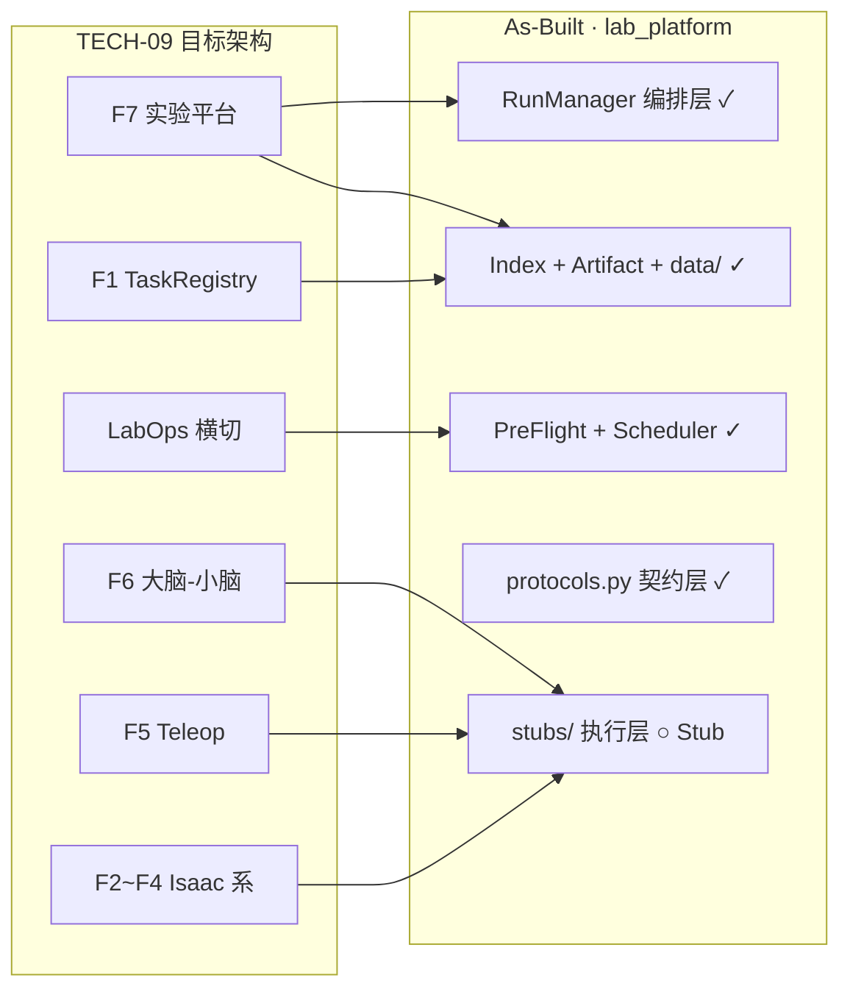
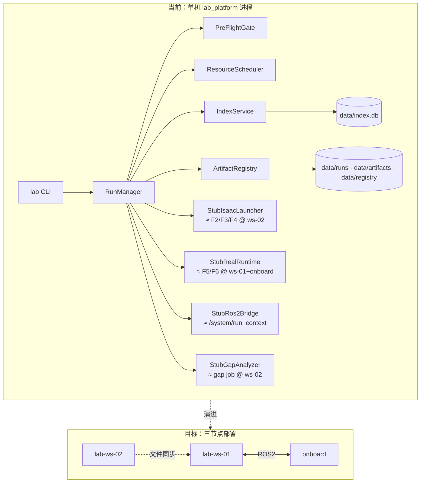
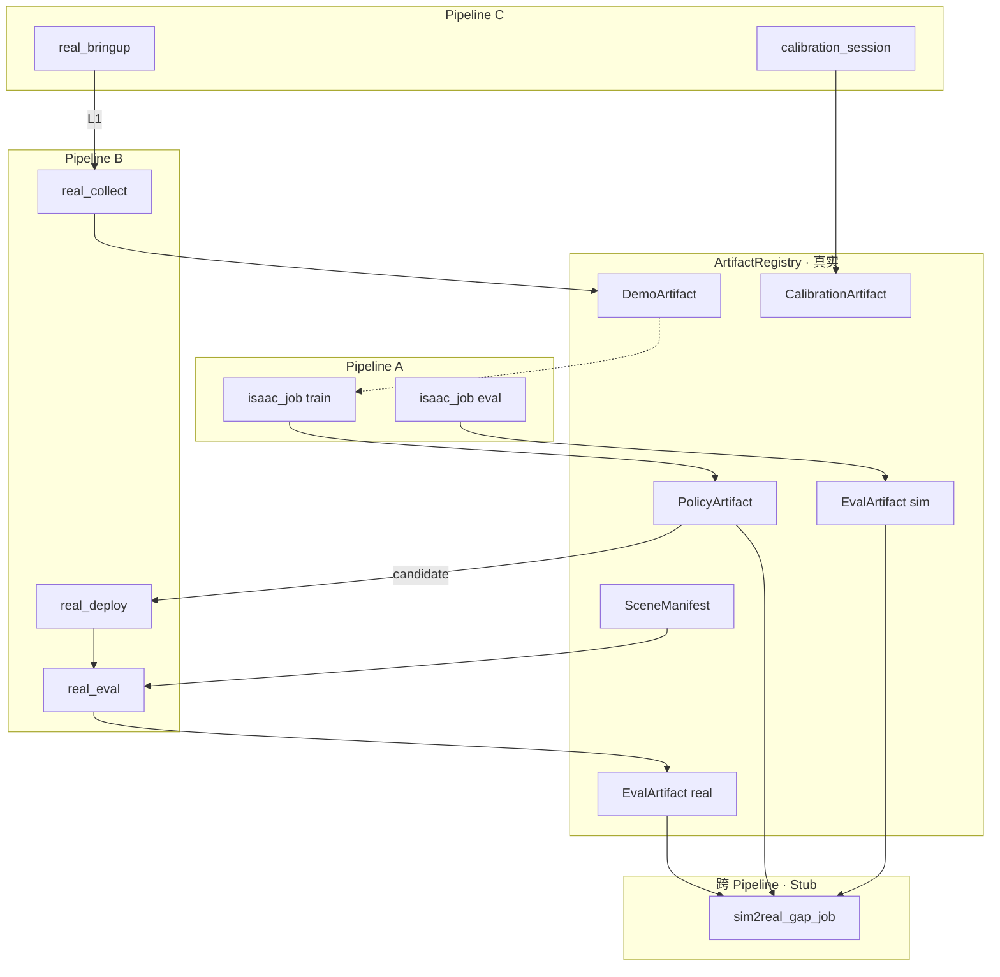
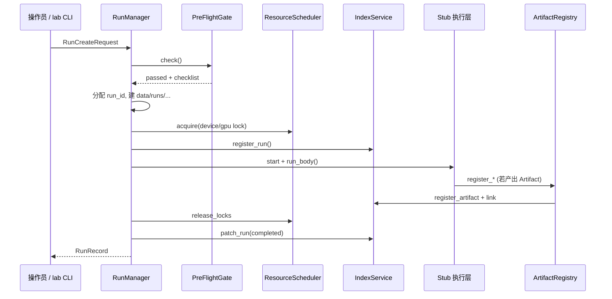

# 平台架构 As-Built 说明 v1.0（Walking Skeleton 评审版）

| 属性 | 内容 |
|------|------|
| **文档编号** | TECH-14 |
| **版本** | v1.0 |
| **日期** | 2026-06-10 |
| **维护人** | P2 |
| **用途** | 团队评审：**设计（TECH-09） vs 当前已实现（lab_platform）** |
| **设计基线** | [TECH-09 platform_technical_architecture_v1.md](./platform_technical_architecture_v1.md) v1.0-approved |
| **实现基线** | `lab_platform/` · [framework_skeleton_design_v1.md](../modules/framework_skeleton_design_v1.md) |
| **验证命令** | `cd lab_platform && pip install -e . && lab init && lab demo full` |

---

## 一、 文档定位

| 文档 | 回答的问题 |
|------|------------|
| **TECH-09** | 平台**应该怎么建**（目标架构、模块职责、Pipeline、LabOps） |
| **本文档 (As-Built)** | 平台**已经建了什么**（代码包结构、真实/Stub 边界、模块映射） |
| **TECH-05/10/11/12/13** | 字段级契约（Run ID、PreFlight、Policy、Isaac 入口） |
| **MDD 系列** | 各模块进入详细设计与编码的输入 |

**评审目标**：
1. 确认 Walking Skeleton 与 TECH-09 **模块边界一致**。
2. 确认 **三条 Pipeline + LabOps 横切** 已在代码中可跑通。
3. 确认 **Stub 替换清单** 可作为三人团队并行开发分工依据。
4. 确认 **缺口清单** 有明确优先级与负责人。

---

## 二、 总体 As-Built 架构

### 2.1 设计 vs 实现 对照



图例：**✓ 真实实现** · **○ Stub 占位**

### 2.2 部署视图 As-Built（逻辑正确，物理未分节点）

TECH-09 要求三节点（ws-02 / ws-01 / onboard）；当前骨架在**单机单进程**中模拟，**交互契约已对齐**：

| 节点 | TECH-09 职责 | As-Built 现状 |
|------|-------------|---------------|
| **lab-ws-02** | Isaac、训练、Index、Artifact 文件 | 本地 `data/` + SQLite；StubIsaacLauncher |
| **lab-ws-01** | RunManager、Rosbag、大脑慢环 | RunManager + StubRos2Bridge（打印 run_context） |
| **onboard** | 小脑快环、Driver Bridge、Limiter | 合并在 StubRealRuntime 内模拟 |



---

## 三、 完整模块架构图（含子模块）

### 3.1 功能模块树（TECH-09 §三 + §八）

```text
具身智能实验室平台
├── F1 任务与资产注册
│   ├── tasks/{task_id}/task_manifest.yaml
│   └── TaskRegistry 索引（Git）
├── Pipeline A · Isaac 系 (ws-02, 无 ROS2)
│   ├── F2 SimLauncher ────────── isaac_job / play
│   ├── F3 Trainer ────────────── isaac_job / train  → PolicyArtifact
│   └── F4 SimEvaluator ───────── isaac_job / eval    → EvalArtifact
│       └── sim2real_gap_job（分析 Job）
├── Pipeline B · Lab Real 系 (ws-01 + onboard, ROS2)
│   ├── F5 示教数采 ───────────── real_collect        → DemoArtifact
│   └── F6 运行时控制
│       ├── F6B 大脑 (ws-01)
│       │   ├── Perception 融合
│       │   ├── Plan
│       │   ├── PolicyRunner(high)
│       │   └── ActionEncoder
│       ├── F6C 小脑 (onboard)
│       │   ├── PolicyRunner(low) / WBC
│       │   ├── ActionDecoder
│       │   ├── Limiter
│       │   └── Driver Bridge → 厂商 SDK
│       ├── F6S Safety 协调
│       ├── real_deploy
│       └── real_eval                               → EvalArtifact
├── Pipeline C · 运维 Run
│   ├── real_bringup                                → Bridge L1
│   └── calibration_session                         → CalibrationArtifact
├── F7 实验与数据平台
│   ├── RunManager（生命周期、Config Pin、run_context）
│   ├── RosbagRecorder
│   ├── IndexService（Run / Artifact / Lock / 血缘）
│   ├── ArtifactRegistry
│   ├── PreFlightGate
│   └── ResourceScheduler
└── Lab Operations Layer（横切 A/B/C）
    ├── PreFlightGate（PF-01..15）
    ├── ResourceScheduler（device_lock / gpu_lock / Z-DYN≤2）
    ├── CalibrationRegistry
    ├── SceneRegistry
    ├── DeviceCapabilityMatrix + BridgeMaturity (L0–L4)
    ├── PolicyArtifact lifecycle
    └── LabOpsMonitor（健康 / 磁盘 / 延迟）
```

### 3.2 Pipeline + Artifact 数据流（As-Built 可跑通路径）



### 3.3 LabOps 横切与 Run 生命周期



---

## 四、 代码包结构（As-Built）

```text
lab_platform/
├── pyproject.toml              # pip install -e . · 入口 lab
├── README.md
└── lab_platform/
    ├── cli.py                  # lab init | demo full | run | isaac | test concurrency
    ├── config.py               # LabConfig · data_root
    ├── models.py               # RunRecord · ArtifactRecord · RunCreateRequest
    ├── ids.py                  # Run/Artifact ID 生成（TECH-05）
    ├── protocols.py            # ★ 模块间接口契约（替换 Stub 不改此文件签名）
    ├── workspace.py            # init_workspace · promote_bridge · registry 模板
    ├── index/
    │   ├── schema.sql          # runs / artifacts / locks / links
    │   └── service.py          # IndexService（真实）
    ├── preflight/
    │   └── gate.py             # DefaultPreFlightGate（真实·骨架级）
    ├── scheduler/
    │   └── locks.py            # DefaultResourceScheduler（真实）
    ├── run_manager/
    │   └── manager.py          # RunManager 编排（真实）
    ├── artifacts/
    │   └── registry.py         # ArtifactRegistry（真实）
    ├── pipelines/
    │   ├── pipeline_a.py       # IsaacPipelineHooks 产出收录（真实）
    │   └── demo_full.py        # 10 步全链路编排
    └── stubs/
        ├── isaac_launcher.py   # StubIsaacLauncher
        ├── real_runtime.py     # StubRealRuntime
        ├── ros2_bridge.py      # StubRos2Bridge
        └── gap_analyzer.py     # StubGapAnalyzer

data/                           # lab init 生成（默认 lab_platform/data/）
├── index.db
├── registry/                   # device_capabilities · bridge_maturity · eval_protocols
├── tasks/
├── runs/                       # isaac_jobs · real_* · calibration_session
├── artifacts/                  # policies · demos · evals · calibrations · scenes
└── jobs/sim2real_gap/
```

---

## 五、 TECH-09 模块 ↔ As-Built 映射表

| TECH-09 | 子模块/功能 | As-Built 实现 | 状态 | 代码路径 |
|---------|------------|---------------|------|----------|
| **F1** | task_manifest | init 写模板 yaml | 最小 | `workspace.py` |
| **F2** | SimLauncher | StubIsaacLauncher | Stub | `stubs/isaac_launcher.py` |
| **F3** | Trainer | 同上 train kind | Stub | 同上 |
| **F4** | SimEvaluator | 同上 eval kind | Stub | 同上 |
| **F4** | Gap 分析 | StubGapAnalyzer | Stub | `stubs/gap_analyzer.py` |
| **F5** | Teleop/DemoRecorder | StubRealRuntime.collect | Stub | `stubs/real_runtime.py` |
| **F6B** | Perception/Plan/Policy高 | StubRealRuntime.deploy/eval | Stub | 同上 |
| **F6C** | Policy低/WBC/Limiter | 同上（无真实控制环） | Stub | 同上 |
| **F6** | Driver Bridge | 无 SDK，仅 Bridge yaml 更新 | Stub | `real_runtime._set_bridge_level` |
| **F6S** | Safety/ESTOP | 未实现 | 缺失 | — |
| **F7** | RunManager | RunManager.execute | **真实** | `run_manager/manager.py` |
| **F7** | IndexService | SQLite 四表 | **真实** | `index/service.py` |
| **F7** | PreFlightGate | PF 子集 01–15 | **真实** | `preflight/gate.py` |
| **F7** | ResourceScheduler | device/gpu lock, Z-DYN≤2 | **真实** | `scheduler/locks.py` |
| **F7** | RosbagRecorder | 写空 .mcap | 占位 | `stubs/real_runtime.py` |
| **F7** | ArtifactRegistry | policy/demo/eval/cal 注册 | **真实** | `artifacts/registry.py` |
| **Pipeline A** | isaac 产出收录 | IsaacPipelineHooks | **真实** | `pipelines/pipeline_a.py` |
| **LabOps** | Device/Bridge | 读 yaml + promote | **真实** | `preflight/gate.py`, `workspace.py` |
| **LabOps** | Calibration/Scene | PreFlight 校验 + 静态 scene | 部分 | `registry/`, `artifacts/scenes/` |
| **LabOps** | LabOpsMonitor | 未实现 | 缺失 | — |
| **LabOps** | Policy lifecycle | draft→candidate（eval 达标） | **真实** | `pipeline_a.py`, `registry.py` |

### 5.1 Protocol 接口清单（并行开发边界）

定义于 `lab_platform/protocols.py`：

| Protocol | 当前实现 | 替换为 |
|----------|----------|--------|
| `IndexClient` | `IndexService` | 可选 HTTP 远程（ws-01→ws-02） |
| `PreFlightGate` | `DefaultPreFlightGate` | 补全 PF 检查 + 接 P3 台账 API |
| `ResourceScheduler` | `DefaultResourceScheduler` | 队列/优先级策略 |
| `IsaacLauncher` | `StubIsaacLauncher` | Isaac Lab 原生命令（TECH-13） |
| `RealRuntime` | `StubRealRuntime` | F5/F6 ROS2 栈 |
| `Ros2Bridge` | `StubRos2Bridge` | `/system/run_context` ROS2 节点 |
| `GapAnalyzer` | `StubGapAnalyzer` | F4 真实 gap 脚本 |

**原则**：替换 Stub 实现类，**不修改** `RunManager` 调用顺序与 `protocols.py` 方法签名。

---

## 六、 Run 类型与 As-Built 分发

| run_type | Pipeline | PreFlight 要点 | 执行入口 | 产出 |
|----------|----------|----------------|----------|------|
| `isaac_job` play/train/eval | A | PF-01, PF-08(train), PF-15 | `_run_isaac` → Stub + Hooks | PA / EA |
| `real_bringup` | C | PF-01, PF-02 | `real.bringup` | bringup_report, L1 |
| `calibration_session` | C | PF-01–03(L≥1) | `real.calibrate` | CalibrationArtifact |
| `real_collect` | B | PF-01–03(L≥2), PF-07, PF-09 | `real.collect` | DemoArtifact |
| `real_deploy` | B | + PF-12, PF-13 | `real.deploy` | rosbag stub |
| `real_eval` | B | + PF-05, PF-06, L≥3 | `real.eval_run` | EvalArtifact(real), L4 |
| `sim2real_gap_job` | 跨 | PF-15(eval×2) | `run_gap_job` | gap_report.json |

Bridge 门槛（As-Built）：`real_eval` 启动要求 **L3**；成功后 Stub 写入 **L4**（避免 L4 前置死锁）。

---

## 七、 骨架期验收状态

| 验收项 | 状态 | 验证方式 |
|--------|------|----------|
| `lab init && lab demo full` 零报错 | ✅ | 2026-06-11 自动化验收 |
| `data/index.db` 含 Run/Artifact 血缘 | ✅ | runs=7, artifacts=6, links=10 |
| 目录结构符合 TECH-05 | ✅ | 见 `lab_platform/data/` |
| Z-DYN 第 3 台并发被拒绝 | ✅ | `lab test concurrency` |
| 替换 Stub 不影响 RunManager | ✅ 设计保证 | Protocol 注入 |

---

## 八、 与设计基线的差距（Gap List）

| 优先级 | 缺口 | TECH-09 依据 | 建议负责人 |
|--------|------|-------------|------------|
| **P0** | `ros2_interface_v1.md` 重写 | §七 慢/快环 Topic | P2 |
| **P0** | StubIsaacLauncher → 真 Isaac CLI | §5.2, TECH-13 | P2 |
| **P1** | StubRealRuntime → F5/F6 ROS2 | §三 F5/F6, §七 | P2 |
| **P1** | StubRos2Bridge → 真 run_context 节点 | §七 `/system/run_context` | P2 |
| **P1** | RosbagRecorder 真实 mcap | §三 F7 Rosbag | P2 |
| **P1** | real_bringup BU-01..06 真实检查 | §8.7, MDD-05 | P2+P3 |
| **P2** | LabOpsMonitor 磁盘/GPU/延迟 | §8.6 | P2 |
| **P2** | IndexService HTTP 化（ws-01 调 ws-02） | §2.3, §三 F7 部署 | P2 |
| **P2** | Config Pin 自动 git commit | §三 横切 Config Pin | P2 |
| **P2** | ws-02→onboard checkpoint 文件同步 | §2.1 文件同步 | P2 |
| **P3** | P3 台账与 `device_capabilities` 联动 | §8.10 maintenance_policy | P3 |

---

## 九、 团队评审清单

评审时请逐项确认（可打勾）：

### 9.1 架构一致性
- [ ] 三条 Pipeline（A/B/C）+ gap job 划分与 TECH-09 §五一致
- [ ] LabOps 横切（PreFlight / Scheduler / Registry）位置正确
- [ ] Artifact 五类传递物与 TECH-09 §5.5 一致
- [ ] 大脑-小脑 / ws-02 无 ROS2 原则在演进路线中保留

### 9.2 As-Built 可接受性
- [ ] Walking Skeleton 策略（真实编排 + Stub 执行）可接受为 Phase-1 基线
- [ ] `protocols.py` 接口边界可作为并行开发契约
- [ ] `lab demo full` 可作为 CI 冒烟测试基准

### 9.3 分工与优先级
- [ ] §八 Gap List 优先级与 RACI 一致
- [ ] 三人并行切分（F7 / Isaac / Real / P3 registry）无重叠冲突

### 9.4 决议
- [ ] **通过** → 进入 Stub 替换阶段（按 §十 路线图）
- [ ] **有条件通过** → 记录修改项，修订后升版 v1.1
- [ ] **不通过** → 退回 TECH-09 或骨架设计修订

**评审记录模板**：

| 角色 | 姓名 | 日期 | 结论 |
|------|------|------|------|
| P1 | | | |
| P2 | | | |
| P3 | | | |

---

## 十、 推荐实施路线图（评审通过后）

```text
Phase 1 · 当前 ✅
  TECH-09 approved → P0 规范 → Walking Skeleton → 本文档 As-Built v1.0

Phase 2 · 并行替换（W2–W4）
  ① ros2_interface_v1 重写（Real 栈前置）
  ② StubIsaacLauncher → Isaac Lab（Pipeline A 先真）
  ③ Pipeline C bringup 真实 BU 检查
  ④ StubRealRuntime.collect → Teleop（F5）
  ⑤ StubRealRuntime.deploy/eval → F6 大脑-小脑

Phase 3 · 生产化（W5+）
  IndexService HTTP · LabOpsMonitor · 三节点部署 · 首台真机 E2E
```

---

## 十一、 相关文档索引

| 文档 | 路径 |
|------|------|
| 目标技术架构 | `docs/architecture/platform_technical_architecture_v1.md` |
| 功能架构 | `docs/architecture/platform_detailed_design_v1.md` |
| 骨架设计 | `docs/modules/framework_skeleton_design_v1.md` |
| Run/Artifact 规范 | `docs/data/run_id_spec.md` |
| MDD 索引 | `docs/modules/README.md` |
| 代码 README | `lab_platform/README.md` |

---

*TECH-14 | platform_architecture_as_built_v1 · 2026-06-10*
