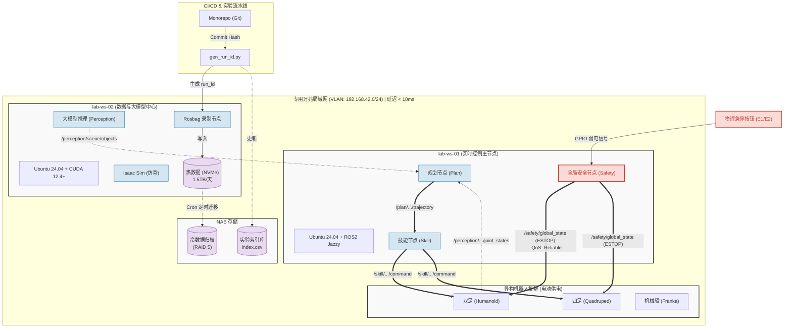

# 平台软件架构与部署拓扑图 (Platform Architecture) v1.1

| 属性 | 内容 |
|------|------|
| **文档编号** | TECH-05 |
| **版本** | v1.1 |
| **维护人** | R2 |
| **依据** | [governance_index_v1.md](../org/governance_index_v1.md) · [plan_review_w1.md](../meeting/plan_review_w1.md) · [version_matrix_v1.md](../software/version_matrix_v1.md) · [infra_plan_draft_v0.md](../infra/infra_plan_draft_v0.md) · [ros2_interface_v1.md](../software/ros2_interface_v1.md) · [run_id_spec.md](../data/run_id_spec.md) |
| **说明** | 整合网络、算力、ROS2 接口与数据流的全局工程视图 |

---

## 一、 平台全局架构与部署拓扑图 (Mermaid)

> 此图展示了物理节点（算力/网络）、软件模块（ROS2 节点）、数据流（Run_ID/Rosbag）以及版本基线的全局映射关系。

---

## 二、 架构图解读 (R2 视角)

本图将 R2 负责的 4 份文档（算力网络、ROS2接口、版本矩阵、数据规范）融为一体：

1. **部署拓扑 (对应 `infra_plan_draft_v0.md`)**：
   - 清晰展示了 `lab-ws-01` 负责轻量级高实时性任务（Plan/Skill/Safety）。
   - `lab-ws-02` 负责吃显存、吃硬盘的重负载任务（VLM/仿真/录包）。
   - 明确了热数据在 `ws-02`，冷数据在 `NAS` 的物理流向。

2. **接口与数据流 (对应 `ros2_interface_v1.md`)**：
   - 虚线为感知流，实线为控制流，**红色粗实线**为 Safety 模块的一票否决控制流。
   - 物理急停按钮的 GPIO 信号如何接入 Safety 节点形成了闭环。

3. **版本与基线 (对应 `version_matrix_v1.md`)**：
   - 节点框内直接标明了 OS 和中间件的基线要求（Ubuntu 24.04 + ROS2 Jazzy / CUDA 12.4+）。

4. **实验追溯 (对应 `run_id_spec.md`)**：
   - 左下角的流水线展示了代码版本（Git Hash）如何通过 `gen_run_id.py` 注入到录包节点（Recorder），最终落盘到存储中。

---

## 三、 变更记录

| 版本 | 日期 | 说明 |
|------|------|------|
| v1.0-draft | 2026-06 | 首版架构拓扑图 |
| **v1.1** | 2026-07-09 | 软件基线 24.04/Jazzy；角色口径 R2；对齐 W1 冻结决策 |
