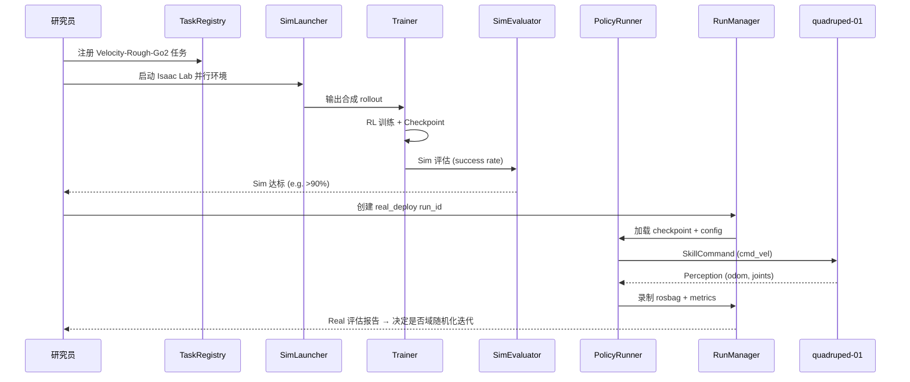
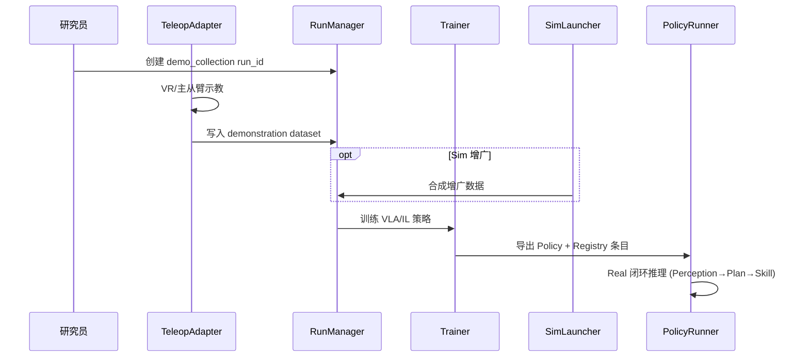

# 具身智能平台软件架构详细设计 v1.0-draft

| 属性 | 内容 |
|------|------|
| **文档编号** | TECH-08 |
| **版本** | v1.0-draft |
| **维护人** | P2 |
| **前置依据** | [系统整体架构设计](./blueprint_v0.md) · [软件版本矩阵](../software/version_matrix_v1.md) |

---

## 一、 设计方法与目标

本详细设计将 P1 顶层架构蓝图转化为**可执行的软件工程框架**。

**设计方法**：以 Isaac Lab 等业界典型任务为参照，先定义**任务域与策略迭代全生命周期**，再推导**功能子系统**与**非功能约束**，最后才导出 ROS2 接口、日志落盘等具体规范。

**设计目标**：
1. 覆盖 **Manipulation / Locomotion / Navigation / Loco-Manipulation** 等多类具身任务，而非单一机械臂抓取。
2. 显式体现 **Sim → Train → Eval → Real → Validate → Iterate** 的 Sim2Real 闭环。
3. 为 `ros2_interface_v1.md`、`run_id_spec.md` 等下游文档提供**可追溯的设计依据**。

---

## 二、 任务域与典型业务场景

参照 [Isaac Lab 预置环境](https://isaac-sim.github.io/IsaacLab/main/source/overview/environments.html) 及实验室现有设备，平台需支持以下任务域：

| 任务域 | 典型任务 (Isaac Lab 参照) | 实验室对应设备 | 控制特征 |
|--------|---------------------------|----------------|----------|
| **Manipulation** | Reach / Lift / Stack / Pick-Place (Franka, GR1) | `franka-01` | 固定基座，末端 6DoF，接触丰富 |
| **Locomotion** | Velocity tracking, Rough terrain (Go2, H1, G1) | `quadruped-01`, `humanoid-*` | 全身/下肢，速度/姿态跟踪 |
| **Navigation** | Goal reaching, Obstacle avoidance | 四足、双足 | 全局路径 + 局部避障 |
| **Loco-Manipulation** | Pick-Place with in-place balancing (G1 Locomanipulation) | `humanoid-*` | 下肢平衡 + 上肢操作耦合 |
| **Contact-rich / Dexterous** | Peg insertion, In-hand reorientation, Dexsuite | `franka-01` + 灵巧手 | 力控、高精度接触 |

### 2.1 多场景驱动的代表性用例

**用例 A — Manipulation (IL/VLA)**  
Franka 抓取并放置物体到目标位（`Isaac-Lift-Cube-Franka` 类任务）。  
流程：真人 VR/主从臂示教 → 数据集构建 → 策略训练 → 真实部署 → 成功率评估。

**用例 B — Locomotion (RL)**  
宇树 Go2 在 rough terrain 上跟踪速度指令（`Isaac-Velocity-Rough-Go2` 类任务）。  
流程：Isaac Lab 大规模并行仿真训练 → Sim 内评估 → 策略导出 → 真实四足零样本/少样本部署 → 域随机化迭代。

**用例 C — Loco-Manipulation (Whole-body)**  
人形机器人原地平衡并完成 pick-place（`Isaac-PickPlace-Locomanipulation-G1` 类任务）。  
流程：仿真中分模块训练（步态 + 上肢 IK）→ 全身策略融合 → 真实双足+臂联调 → 安全降级验证。

**用例 D — Sim2Real 闭环迭代**  
某策略在 Sim 成功率 95%、Real 仅 60%。  
流程：对比 Sim/Real 的 `run_id` 数据 → 定位感知/动力学 Gap → 调整域随机化或补充 Real 示教 → 重新训练 → 再部署。

---

## 三、 策略迭代全生命周期 (Sim2Real Pipeline)

平台的核心不是“四个独立子系统”，而是一条**可重复执行的策略迭代流水线**：

```mermaid
flowchart LR
    subgraph L0 ["0. 任务定义"]
        T1[Task Registry<br>MDP/奖励/成功条件]
        T2[Asset & Robot Model<br>URDF/USD/标定]
    end

    subgraph L1 ["1. 仿真 (Sim)"]
        S1[Isaac Sim / Lab 环境]
        S2[Domain Randomization]
        S3[Synthetic Dataset]
    end

    subgraph L2 ["2. 训练 (Train)"]
        TR1[RL / IL / VLA 训练]
        TR2[Experiment Tracking]
        TR3[Checkpoint & Policy Registry]
    end

    subgraph L3 ["3. 仿真评估 (Sim Eval)"]
        E1[Benchmark / Metrics]
        E2[Sim Replay & Debug]
    end

    subgraph L4 ["4. 真实数采 (Real Teleop)"]
        R1[VR / Leader Arm / RC]
        R2[Demonstration Dataset]
    end

    subgraph L5 ["5. 真实部署 (Real Deploy)"]
        D1[Policy Runner]
        D2[Perception → Plan → Skill]
        D3[Driver Bridge]
    end

    subgraph L6 ["6. 真实评估与迭代 (Real Eval)"]
        V1[Success Rate / Safety Events]
        V2[Sim vs Real Gap Analysis]
        V3[CR / Retrain Decision]
    end

    L0 --> L1 --> L2 --> L3
    L3 -->|策略达标| L5
    L3 -->|需 Real 数据| L4 --> L2
    L5 --> L6
    L6 -->|Gap 未关闭| L1
    L6 -->|Gap 未关闭| L4
    L6 -->|通过| L0
```



**关键原则**：
- **Sim 与 Real 共用同一套语义接口**（Perception / Plan / Skill / Safety），避免“仿真一套、真机一套”。
- 每个阶段产出必须绑定 `run_id` 或 `experiment_id`，支持跨阶段追溯。
- Sim2Real 不是单次跳转，而是 **L3 → L5 → L6 → (L1|L4) → L2** 的可迭代环。

---

## 四、 平台功能性架构 (Functional Architecture)

为支撑第三节全生命周期，平台划分为 **三层 + 七个子系统**（非四个子系统的平铺）。

### 4.1 三层逻辑视图

```
┌─────────────────────────────────────────────────────────────────┐
│  L-A 策略开发与迭代层 (Development & Iteration)                  │
│  Task Registry · Sim Env · Training · Sim Eval · Gap Analysis   │
├─────────────────────────────────────────────────────────────────┤
│  L-B 真实世界运行层 (Real-World Runtime)                         │
│  Teleop · Policy Deploy · Perception→Plan→Skill · Safety        │
├─────────────────────────────────────────────────────────────────┤
│  L-C 平台基础服务层 (Platform Services)                          │
│  Experiment/Run · Data · Policy Registry · Config · CI · Monitor  │
└─────────────────────────────────────────────────────────────────┘
                              │
                    Driver Bridge · 异构硬件
```

### 4.2 七个子系统（按生命周期映射）

| # | 子系统 | 职责 | 覆盖阶段 | 主要模块 |
|---|--------|------|----------|----------|
| **F1** | 任务与资产注册 | 定义任务类型、MDP、奖励、成功条件；管理 URDF/USD/标定参数 | L0 | `TaskRegistry`, `RobotAssetCatalog`, `EnvConfig` |
| **F2** | 仿真与合成数据 | Isaac Sim/Lab 环境实例化、域随机化、合成轨迹/图像导出 | L1 | `SimLauncher`, `DomainRandomizer`, `SyntheticExporter` |
| **F3** | 训练与实验追踪 | RL/IL/VLA 训练流水线、超参/指标/Checkpoint 管理 | L2 | `Trainer`, `ExpTracker`, `CheckpointStore` |
| **F4** | 仿真评估与回放 | Sim 内 Benchmark、策略回放、与 Real 对比基线 | L3, L6 | `SimEvaluator`, `MetricsCollector`, `GapAnalyzer` |
| **F5** | 真实示教与数采 | VR/主从臂/遥控器示教，多模态同步录制 | L4 | `TeleopAdapter`, `SensorSync`, `DemoRecorder` |
| **F6** | 策略部署与运行时控制 | 策略加载、Perception→Plan→Skill 流水线、多任务域动作解码 | L5 | `PolicyRunner`, `ActionDecoder`, `TaskScheduler` |
| **F7** | 实验与数据平台 | run_id、日志、rosbag、Policy 版本、索引与检索 | L0–L6 | `RunManager`, `DataRecorder`, `PolicyRegistry`, `IndexService` |

**与旧版“四子系统”的差异**：
- 原设计缺少 **F1/F2/F3/F4**，Sim 与 Train 未入架构，Sim2Real 无法闭环。
- 原 `Pipeline Management` 仅对应 **F7** 的一部分；原 `Teleop` 仅对应 **F5**；原 `Policy Inference` 仅对应 **F6** 的一部分。

### 4.3 任务域在运行时的统一抽象

不同任务域在 **F6 运行时** 通过统一抽象接入，避免为每种机器人写死一套 Topic：

| 任务域 | Plan 输出语义 | Skill 输出语义 | 典型 device_id |
|--------|---------------|----------------|----------------|
| Manipulation | 末端轨迹 / 关节轨迹 | 力矩 / 位置控制 | `franka-01` |
| Locomotion | 速度指令 / 足端轨迹 | 步态 / 关节 PD | `quadruped-01` |
| Loco-Manipulation | 上肢轨迹 + 下肢平衡目标 | 全身协调控制 | `humanoid-01` |
| Navigation | 全局路径 / 局部 cmd_vel | 同 Locomotion | `quadruped-01`, `humanoid-*` |

**架构决策**：`ActionDecoder` 按 `task_type` + `device_id` 插件化，而非按场景写独立节点。

### 4.4 横切能力：安全与驱动

以下能力**贯穿 L-B 与 L-C**，不单独算作“业务子系统”，但是强制模块：

| 模块 | 职责 | 关联 P1 契约 |
|------|------|--------------|
| **Driver Bridge** | 厂商 SDK 封装，输出统一 Perception / 接收 SkillCommand | 软硬解耦 |
| **Safety Runtime** | 限幅、软停、急停广播、三级安全响应 | HSI 三级急停 |
| **Config & Version Pin** | 锁定 OS/ROS/Isaac/模型版本，写入 metadata | 版本矩阵 |

---

## 五、 平台非功能性架构 (NFR)

| NFR 维度 | 业务驱动 | 架构决策 | 导出文档 |
|----------|----------|----------|----------|
| **实时性** | Locomotion/Loco-manip 控制环 50–500Hz；Teleop 延迟敏感 | 控制 Topic Reliable；图像 Best Effort；Safety 最高优先级 | `ros2_interface_v1.md` |
| **数据血缘** | Sim/Real 对比、训练复现、审计 | 全阶段 `run_id` / `experiment_id`；Git Hash + config 快照 | `run_id_spec.md` |
| **Sim2Real 一致性** | 同一策略 Sim 与 Real 行为对齐 | 统一消息语义；Policy Registry 记录 sim_checkpoint ↔ real_deploy 映射 | 待补充 `policy_registry_spec.md` |
| **可扩展性** | 100+ Isaac Lab 类任务 | TaskRegistry 插件化；EnvConfig 与代码分离 | F1 模块设计 |
| **安全** | 策略输出奇异值、人机共场 | ActionDecoder 前 Limiter；独立 Safety_Node | `safety_sop_v1.md` |
| **存储吞吐** | 多机并发、多相机、长时训练 | 热/冷分层；训练 artifact 与 rosbag 分目录 | `infra_plan_draft_v0.md` |

---

## 六、 架构到详细设计文档的映射

| 层级 | 文档 | 状态 |
|------|------|------|
| 功能架构 | 本文档 (TECH-08) | draft |
| **详细技术架构** | `platform_technical_architecture_v1.md` (TECH-09) | **draft，当前阶段** |
| 接口与数据规范 | `ros2_interface_v1.md`、`run_id_spec.md` 等 | draft，**待 TECH-09 评审后重写** |

---

## 七、 典型流程时序图

### 7.1 RL Locomotion Sim2Real（用例 B）



### 7.2 IL Manipulation + 可选 Sim 增广（用例 A）



---

## 八、 下一步 (P2)

1. ~~**评审** TECH-09~~ → **v1.0-approved**（2026-06-10）
2. ~~P0 规范导出~~ → TECH-05/10/11/12/13
3. ~~MDD 启动~~ → 见 `docs/modules/README.md`
4. **进行中**：按顺序实现 IndexService → RunManager → Isaac Adapter → Pipeline C
5. **P1**：重写 `ros2_interface_v1.md`，完善 Real 栈 MDD

---

*TECH-08 | platform_detailed_design_v1*
