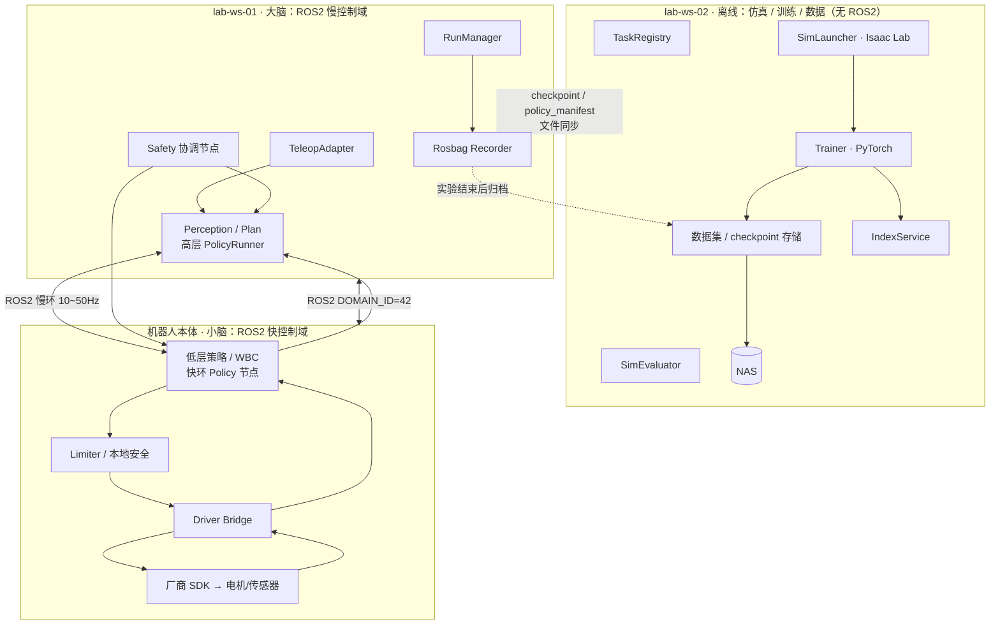
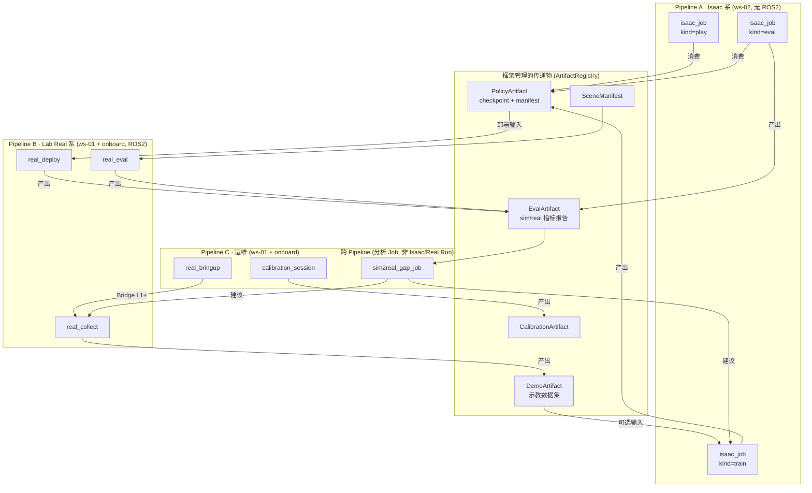
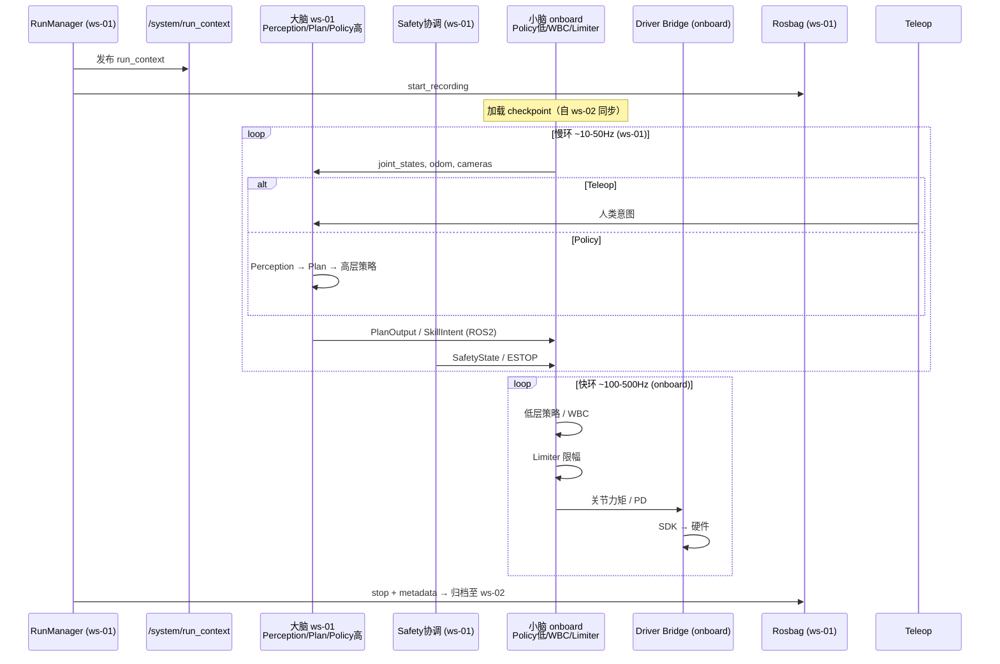
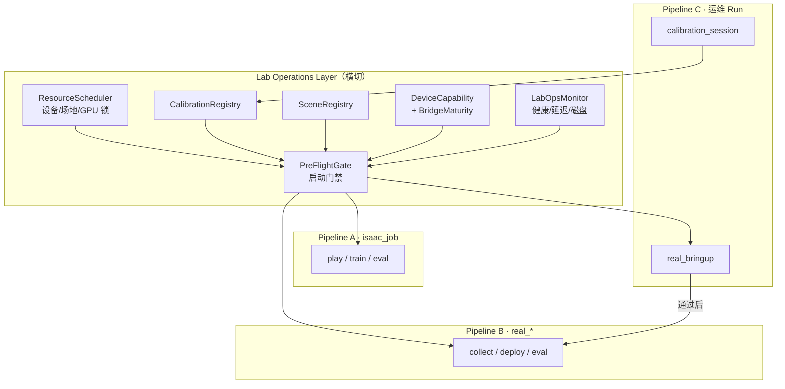

# 具身智能平台详细技术架构 v1.0-draft


| 属性       | 内容                                                                                                         |
| -------- | ---------------------------------------------------------------------------------------------------------- |
| **文档编号** | TECH-09                                                                                                    |
| **版本**   | v1.0-approved                                                                                              |
| **维护人**  | P2                                                                                                         |
| **评审**   | 2026-06-10 · P1/P2/P3 短评审通过（见 `docs/meeting/tech09_review_v1.md`）                                          |
| **前置依据** | [平台软件架构详细设计（功能架构）](./platform_detailed_design_v1.md)                                                       |
| **下游文档** | `run_id_spec.md`、`preflight_checklist_spec.md`、`policy_registry_spec.md`、`isaac_job_adapter_v1.md`、各模块 MDD |


---

## 一、 文档定位与设计分层

```
P1  blueprint_v0          逻辑契约（Why / 边界）
        ↓
P2  platform_detailed_design_v1   功能架构（What / 子系统 / 生命周期）
        ↓
P2  platform_technical_architecture_v1  ← 本文档
        详细技术架构（How / 模块 / 交互 / Run 产物）
        ↓
P2  ros2_interface_v1 / run_id_spec / policy_registry_spec
        接口与数据规范（字段级 / Topic 级）
```

**本文档回答的问题**：

1. 各功能子系统（F1–F7）在技术层面**如何实现、部署在哪、输入输出是什么**。
2. 模块之间**以何种方式交互**（进程内 / ROS2 / 文件 / 索引服务）。
3. 一次完整「轮次（Run）」在系统内**如何流转**，**产生什么产物**，**必须记录什么**（功能数据 + 非功能审计数据）。
4. 上述结论如何**约束**后续 ROS2 与 run_id 设计，而非替代它们。
5. **实验室日常运行**（门禁、资源锁、标定/场景、Bridge 成熟度）如何通过 **Lab Operations Layer（§八）** 横切于各 Pipeline。

---

## 二、 技术架构总览

### 2.1 部署与进程视图（大脑-小脑分层）

**架构原则**：

- **lab-ws-02**：离线计算节点，**不加入实验室 ROS2 域**。仅运行 Isaac Sim/Lab、策略训练、数据集与 checkpoint 管理。
- **lab-ws-01**：**大脑（慢控制）**，运行 ROS2 Jazzy，负责感知融合、规划、高层策略推理、实验管理与 rosbag 录制；通过 ROS2 与机器人本体通信。
- **机器人本体 onboard**：**小脑（快控制）**，运行 ROS2 节点，负责低层策略/WBC、高频控制环、驱动桥（Driver Bridge）与本体传感器发布。




### 2.2 大脑-小脑控制分工


| 层级        | 部署          | 控制频率        | 典型职责                                             | 典型模块                                             |
| --------- | ----------- | ----------- | ------------------------------------------------ | ------------------------------------------------ |
| **大脑（慢）** | lab-ws-01   | 10–50 Hz    | 任务理解、路径/轨迹规划、VLM/高层策略推理、Teleop 意图解析、全局 Safety 协调 | Perception, Plan, PolicyRunner(high), RunManager |
| **小脑（快）** | 机器人 onboard | 100–500+ Hz | 步态/WBC、关节 PD、力矩闭环、底层策略执行、驱动 SDK 封装               | PolicyRunner(low), Limiter, Driver Bridge        |
| **离线**    | lab-ws-02   | —           | 仿真、训练、评估、数据索引                                    | SimLauncher, Trainer, SimEvaluator               |


**合理性说明**：

1. **ws-02 无 ROS2**：训练/仿真与真机控制解耦，避免 DDS 域污染与 GPU 资源争抢；checkpoint 经**文件同步**部署到 ws-01/机器人。
2. **大脑在 ws-01**：算力足够承担感知与规划；与机器人间走局域网 ROS2，延迟可接受（慢环）。
3. **小脑在 onboard**：控制环必须贴近驱动与 IMU/关节反馈，满足 Locomotion 等高实时需求；Driver Bridge **必须在本体**，禁止远程跨网直接调 SDK。

### 2.3 交互方式分类


| 交互类型                   | 适用场景                                      | 典型模块                             | 设计约束                                           |
| ---------------------- | ----------------------------------------- | -------------------------------- | ---------------------------------------------- |
| **ROS2 Topic/Service** | ws-01 ↔ 机器人本体 慢/快控制、感知回传                  | F5, F6B, F6C, F6S, Driver Bridge | 同一 `ROS_DOMAIN_ID=42`；由 `ros2_interface_v1` 定义 |
| **文件系统 + 目录契约**        | ws-02 训练 artifact；checkpoint 部署；rosbag 归档 | F2, F3, F7D                      | ws-02 **不经 ROS2** 交换数据                         |
| **索引服务（轻量 DB）**        | 跨 Run 检索、Sim↔Real 关联                      | F7I, PolicyRegistry              | 部署在 ws-02                                      |
| **配置注册表（Git 管理）**      | 任务定义、环境参数                                 | F1                               | YAML/JSON in monorepo                          |
| **CLI / 批处理作业**        | 训练启动、数据迁移、评估                              | F3, F4                           | 必须绑定 `experiment_id`                           |


**原则**：

- **ws-02 全程无 ROS2**；Sim/Train/Eval 产出均为文件 + 索引。
- **Real 运行时 ROS2 域仅包含 ws-01 与 机器人 onboard**。
- Sim 与 Real 通过 **相同语义接口**（Plan/Skill 抽象）+ **PolicyRegistry** 对齐，而非共用同一进程拓扑。

---

## 三、 模块技术规格（F1–F7 + 横切）

### F1 任务与资产注册


| 项        | 说明                                                     |
| -------- | ------------------------------------------------------ |
| **实现形态** | Git 仓库内 `tasks/{task_id}/` 目录 + `TaskRegistry` 索引 YAML |
| **部署**   | lab-ws-02（主）；ws-01 只读同步                                |
| **核心输入** | 任务域、device_id、Isaac Lab env 名、奖励/成功条件、URDF/USD 路径      |
| **核心输出** | `task_manifest.yaml`；供 F2/F3/F6 引用                     |
| **不负责**  | 运行时控制、具体 Topic 定义                                      |


### F2 仿真与合成数据


| 项           | 说明                                                 |
| ----------- | -------------------------------------------------- |
| **实现形态**    | Isaac Lab 独立进程（headless/GUI）；`SimLauncher` CLI     |
| **部署**      | lab-ws-02（5090D）                                   |
| **核心输入**    | `task_manifest.yaml`、域随机化配置、上游 `isaac_job_id`（可选）  |
| **核心输出**    | rollout 数据集（hdf5/npz）、仿真日志；纳入当前 `isaac_job` Run 目录 |
| **与 F7 关系** | 每次 Sim 启动创建 `isaac_job_id`，写入 IndexService（ws-02）  |


### F3 训练与实验追踪


| 项           | 说明                                                   |
| ----------- | ---------------------------------------------------- |
| **实现形态**    | Python 训练脚本 + `ExpTracker`（本地/W&B 可选）                |
| **部署**      | lab-ws-02                                            |
| **核心输入**    | 数据集路径、`isaac_job_id`、超参 config；IL 时引用 `DemoArtifact` |
| **核心输出**    | checkpoint、训练曲线、**PolicyArtifact** 注册条目              |
| **与 F7 关系** | `isaac_job_id` 关联上游 `DemoArtifact` 或 `task_manifest` |


### F4 仿真评估与 Gap 分析


| 项           | 说明                                                             |
| ----------- | -------------------------------------------------------------- |
| **实现形态**    | 批处理评估脚本 + `MetricsCollector`                                   |
| **部署**      | lab-ws-02                                                      |
| **核心输入**    | `PolicyArtifact`、`isaac_job_id`、benchmark / `eval_protocol_id` |
| **核心输出**    | **EvalArtifact**（sim 指标）、回放视频/曲线                               |
| **与 F6 关系** | Sim 指标作为 Real Eval 对比基准                                        |


### F5 真实示教与数采


| 项           | 说明                                                            |
| ----------- | ------------------------------------------------------------- |
| **实现形态**    | ROS2 节点：`TeleopAdapter`、`SensorSync`、`DemoRecorder`           |
| **部署**      | lab-ws-01 + 可选 laptop；传感器在机器人/外置相机                            |
| **核心输入**    | VR/LeaderArm/SpaceMouse、`real_collect` run_id、`task_manifest` |
| **核心输出**    | 时间对齐的多模态 demonstration 数据集 + rosbag + **DemoArtifact**        |
| **与 F6 关系** | 示教数据与部署策略共用 Perception/Skill 语义                               |


### F6 策略部署与运行时控制（大脑 + 小脑）


| 项                       | 说明                                                                                       |
| ----------------------- | ---------------------------------------------------------------------------------------- |
| **实现形态**                | 拆为 **F6B（大脑）** 与 **F6C（小脑）** 两组 ROS2 节点                                                  |
| **F6B 部署（ws-01）**       | Perception 融合、Plan、高层 PolicyRunner（VLM/轨迹级）、Teleop 接入                                    |
| **F6C 部署（机器人 onboard）** | 低层 Policy（RL 步态/WBC）、Limiter、Driver Bridge                                               |
| **核心输入**                | **PolicyArtifact**（文件同步至 ws-01/onboard）、`real_deploy`/`real_eval` run_id、`task_manifest` |
| **核心输出**                | 慢环：Plan/Skill 意图；快环：关节力矩/PD；Safety 事件                                                    |
| **插件点**                 | F6B `ActionEncoder` 按 task_type 编码意图；F6C `ActionDecoder` 解码为驱动指令                         |


### F7 实验与数据平台


| 项        | 说明                                                                                           |
| -------- | -------------------------------------------------------------------------------------------- |
| **实现形态** | `RunManager`（ROS2 节点 + CLI）、**PreFlightGate**、**ResourceScheduler**、`IndexService`、Cron 迁移任务 |
| **部署**   | RunManager/Rosbag 在 **ws-01**（ROS2 域内）；IndexService/Registry/归档在 **ws-02/NAS**（无 ROS2）       |
| **核心输入** | 各 Pipeline Run 创建请求；Calibration/Scene/Device 注册表                                             |
| **核心输出** | 目录树、metadata、index 记录、resource_locks、冷热迁移                                                    |
| **全局职责** | 为所有 Run 分配 ID、**PreFlight 校验**、快照 config、关联 git commit；详见 **§八**                             |


### 横切：Driver Bridge / Safety / Config Pin


| 模块                | 实现                              | 部署                        |
| ----------------- | ------------------------------- | ------------------------- |
| **Driver Bridge** | 封装厂商 SDK，发布本体 Perception        | **机器人 onboard（强制）**       |
| **Limiter**       | 关节/速度限幅                         | **机器人 onboard（快环最后一道闸）**  |
| **Safety 协调**     | 全局 ESTOP 广播、GPIO 急停、run_context | **ws-01**；onboard 订阅并本地执行 |
| **Config Pin**    | Run 启动时快照 config                | ws-01 RunManager          |


---

## 四、 Run 划分：设计反思与修订原则

### 4.1 原「6 种 Run」的问题

原先按功能架构生命周期（L0–L6）**机械映射**出 6 类 Run（`sim_run` / `train_exp` / `sim_eval` / `demo_session` / `real_run` / `real_eval`）。存在以下问题：


| 问题               | 说明                                                           |
| ---------------- | ------------------------------------------------------------ |
| **混淆「阶段」与「工具链」** | `sim_run` 与 `train_exp` 在 Isaac 实践中常是同一套 Sim+Lab 环境，强行拆开反而重复 |
| **忽视成熟度差异**      | Isaac 系已有成熟 CLI/流程；真机部署/评估无统一框架，不应与 Isaac Run 同级对待           |
| **缺少传递物抽象**      | 上下游靠 run_id 硬连，未明确「策略 checkpoint」「示教数据集」等**可复用 Artifact**    |


### 4.2 修订后的划分依据

Run 类型按 **三条 Pipeline + 传递物 + LabOps 门禁** 划分，而非简单对应 6 个业务阶段：

```
划分维度 1：Pipeline 归属
  ├─ Pipeline A · Isaac 系（成熟外部工具链）→ 薄封装，不重造轮子
  ├─ Pipeline B · Lab Real 系（自研）→ 大脑-小脑 ROS2 + 多厂家 Driver Bridge
  └─ Pipeline C · 运维 Run → bringup / 标定，为 B 提供前置条件

划分维度 2：业务意图（job_kind / run_kind）
  └─ 同一 Pipeline 内用 kind 区分 play / train / eval / collect / deploy …

划分维度 3：跨 Pipeline 传递
  └─ 用 Artifact（策略包、数据集、评估报告、标定、场景）连接上下游

划分维度 4：Lab Operations（§八）
  └─ PreFlightGate / ResourceScheduler 横切 A/B/C，不替代 Run 类型本身
```

### 4.3 框架集成原则（不重复造轮子）


| Pipeline            | 框架做什么                                                                                    | 框架不做什么                                                              |
| ------------------- | ---------------------------------------------------------------------------------------- | ------------------------------------------------------------------- |
| **Isaac 系**         | 提供统一**入口**（CLI/模板）；登记 Run；快照输入 config；**自动收录** Isaac 产出到 ArtifactRegistry；建立与下游 Real 的索引 | 不改写 Isaac Sim/Lab 内部训练循环、环境定义、RL 算法实现                               |
| **Lab Real 系**      | 设计并实现 ROS2 大脑-小脑栈；RunManager；多厂家 Driver Bridge；Safety；rosbag 规范                          | 不假设厂家提供统一部署框架，按 device 插件化                                          |
| **运维 (Pipeline C)** | `real_bringup` / `calibration_session` 登记；Bridge 成熟度；CalibrationRegistry                 | 不替代厂家 SDK 标定工具，只做产出纳管                                               |
| **跨 Pipeline**      | 定义 Policy/Demo/Eval/Calibration/Scene Artifact 契约；Sim↔Real Gap 分析 Job                    | 不强制 Isaac checkpoint 格式与 onboard 推理格式相同，用 **policy_manifest** 做转换声明 |


---

## 五、 修订后的 Run 类型与 Artifact 传递

### 5.1 总览：三条 Pipeline + 核心 Artifact

> **LabOps 横切层**（PreFlight、资源锁、Bridge 成熟度）见 **§八**；下图侧重研发数据流。




### 5.2 Pipeline A：`isaac_job`（一种 Run，三种 kind）

**依据**：对应 Isaac 官方已成熟的三种典型操作，软件栈不同但**同属 ws-02 离线域**，框架用 `job_kind` 区分即可，不必拆成 3 种 Run 类型。


| job_kind  | 业务场景                 | 主要软件                           | 典型输入 Artifact                         | 典型输出 Artifact                              |
| --------- | -------------------- | ------------------------------ | ------------------------------------- | ------------------------------------------ |
| **play**  | 虚拟环境中回放/展示已有策略       | Isaac Sim（+ 可选 Isaac Lab 推理脚本） | `PolicyArtifact`                      | 可选 `EvalArtifact`（可视化录屏）                   |
| **train** | 仿真中 RL/IL/VLA 训练     | Isaac Sim + **Isaac Lab**      | `task_manifest`；IL 时可选 `DemoArtifact` | `**PolicyArtifact`**（checkpoint + metrics） |
| **eval**  | 仿真 Benchmark / 成功率评估 | Isaac Lab eval                 | `PolicyArtifact`                      | `**EvalArtifact`**（sim 指标）                 |


**框架入口（薄封装）**：

```bash
# 示例：框架只负责登记、快照、收录；内部调用 Isaac 原生命令
lab isaac run --kind train --task velocity_rough_go2 --config configs/train.yaml
# → 创建 isaac_job_id，写入 index
# → 调用 Isaac Lab 官方 train 入口
# → 结束后扫描输出目录，注册 PolicyArtifact(policy_id=...)
```

**框架维护的 Run 目录（示例）**：

```text
runs/isaac_jobs/{isaac_job_id}/
├── metadata.json          # kind, task_id, upstream_artifact_ids[]
├── inputs/                # 快照：引用的 policy/demo/task config
├── workspace/             # Isaac 工作目录（软链或拷贝）
└── outputs.manifest.json  # 指向 ArtifactRegistry 中的 PA/EA
```

---

### 5.3 Pipeline B：Lab Real 系（三种 Run，自研为主）

**依据**：真机侧无成熟统一框架，需自研；三种 Run 对应**不同软件栈与 NFR**，不宜合并。


| Run 类型           | 业务场景                            | 主要软件/环境                                           | 典型输入                             | 典型输出                            |
| ---------------- | ------------------------------- | ------------------------------------------------- | -------------------------------- | ------------------------------- |
| **real_collect** | 真人示教 / 遥操作数采                    | ROS2 Jazzy（ws-01↔onboard）、Teleop 设备、Driver Bridge | `task_manifest`                  | `**DemoArtifact`** + rosbag     |
| **real_deploy**  | 策略在真机执行（含 Teleop 试运行）           | 大脑-小脑 ROS2 栈、PolicyRunner、Safety                  | `**PolicyArtifact`**             | rosbag、`EvalArtifact`(optional) |
| **real_eval**    | 结构化真机 Benchmark（多 episode、固定协议） | 同 deploy + 评估脚本                                   | `PolicyArtifact` + eval_protocol | `**EvalArtifact`**（real 指标）     |


**与 Isaac 的兼容点**：

- `real_deploy` 加载的 `PolicyArtifact` 来自 `isaac_job(kind=train)`，经 **policy_manifest** 声明：网络结构、输入观测空间、onboard 推理节点如何加载（ONNX/torchscript/原生 .pt）。
- 各厂家本体通过 **Driver Bridge 插件** 适配，不改 PolicyArtifact 格式。

---

### 5.4 跨 Pipeline：`sim2real_gap_job`（分析 Job，不是第 7 种 Run）

**依据**：Gap 分析不运行机器人、不启动 Isaac，只是对比已有 `EvalArtifact`。

```
输入：EvalArtifact(sim) + EvalArtifact(real) + 关联 policy_id
输出：gap_report.json + 迭代建议（调 domain_rand / 补 real_collect / 重训）
```

---

### 5.5 Artifact（上下游传递的核心）

Run 会结束，**Artifact 持久存在**并被下游引用。用户通过 ArtifactRegistry 检索，无需手动翻目录。

#### 5.5.1 研发主线 Artifact


| Artifact | 代码               | 生产者                                         | 消费者                                              | 核心内容                                                               |
| -------- | ---------------- | ------------------------------------------- | ------------------------------------------------ | ------------------------------------------------------------------ |
| **策略包**  | `PolicyArtifact` | `isaac_job(train)`；未来也可 `real_collect`+离线训练 | `isaac_job(play/eval)`、`real_deploy`、`real_eval` | checkpoint 路径、policy_manifest.yaml、metrics 摘要、**lifecycle_status** |
| **示教集**  | `DemoArtifact`   | `real_collect`                              | `isaac_job(train)` IL 路线                         | episode 索引、rosbag/demo 路径、device/task 元数据                          |
| **评估报告** | `EvalArtifact`   | `isaac_job(eval)`、`real_eval`               | `sim2real_gap_job`、人工决策                          | success_rate、episode_stats、**eval_protocol_id**                    |


#### 5.5.2 运行支撑 Artifact（LabOps，§八）


| Artifact | 代码                    | 生产者                   | 消费者                          | 核心内容                                         |
| -------- | --------------------- | --------------------- | ---------------------------- | -------------------------------------------- |
| **标定包**  | `CalibrationArtifact` | `calibration_session` | PreFlight、`real_deploy/eval` | 外参/手眼/零位、valid_until                         |
| **场景清单** | `SceneManifest`       | P3 场地登记 + eval 前确认    | `real_eval`、PreFlight        | layout_version、object_poses、eval_protocol_id |


**policy_manifest.yaml（示例字段，待 policy_registry_spec 导出）**：

```yaml
policy_id: pol_20260609_go2_velocity_v1
source_isaac_job_id: isaac_20260608_train_001
task_id: velocity_rough_go2
task_domain: locomotion          # manipulation | locomotion | loco_manipulation
checkpoint: checkpoints/best.pt
observation_schema: ...          # 与 ROS Perception 对齐
action_schema: ...               # 与 SkillIntent 对齐
onboard_runtime: onnx            # onboard 小脑如何加载
supported_devices: [quadruped-01]
```

---

### 5.6 各 Run / Job 的软件栈与框架介入度


| 类型                  | kind  | 主机            | ROS2 | 核心第三方栈                   | 框架介入度                        |
| ------------------- | ----- | ------------- | ---- | ------------------------ | ---------------------------- |
| isaac_job           | play  | ws-02         | 否    | Isaac Sim                | **低**：入口 + 收录                |
| isaac_job           | train | ws-02         | 否    | Isaac Sim + Isaac Lab    | **低**：入口 + 收录                |
| isaac_job           | eval  | ws-02         | 否    | Isaac Lab                | **低**：入口 + 收录                |
| real_collect        | —     | ws-01+onboard | 是    | Teleop SDK、Driver Bridge | **高**：自研 Teleop + 录制         |
| real_deploy         | —     | ws-01+onboard | 是    | 自研 PolicyRunner + 厂家 SDK | **高**：自研全栈                   |
| real_eval           | —     | ws-01+onboard | 是    | 同 deploy + eval 协议       | **高**：协议 + 指标                |
| real_bringup        | —     | ws-01+onboard | 是    | Driver Bridge + 厂家 SDK   | **中**：smoke + Bridge L1      |
| calibration_session | —     | ws-01+onboard | 是    | 标定工具 + Driver Bridge     | **中**：产出 CalibrationArtifact |
| sim2real_gap_job    | —     | ws-02         | 否    | 分析脚本                     | **中**：读 Artifact             |


---

### 5.7 典型 Sim2Real 链路（串联示例）

**用例 B：四足 Locomotion RL（几乎纯 Isaac → Real）**

```
isaac_job(train) → PolicyArtifact
  → isaac_job(eval) → EvalArtifact(sim)
  → real_deploy → real_eval → EvalArtifact(real)
  → sim2real_gap_job → 决定是否重训
```

**用例 A：Franka 抓取 IL（Real 数采 → Isaac 增广/训练 → Real）**

```
real_collect → DemoArtifact
  → isaac_job(train, IL) → PolicyArtifact
  → real_deploy → real_eval
```

**用例：仅虚拟验证策略（无真机）**

```
isaac_job(train) → PolicyArtifact → isaac_job(play)   # 只需 Sim，无需 Real Run
```

---

## 六、 各 Run 最小产物清单（供 run_id_spec 导出）

### 6.1 `isaac_job`（共用目录结构，metadata 内区分 kind）


| 产物                                            | play | train  | eval   |
| --------------------------------------------- | ---- | ------ | ------ |
| metadata.json（含 kind, task_id, git, isaac 版本） | ✓    | ✓      | ✓      |
| inputs/ 快照                                    | ✓    | ✓      | ✓      |
| PolicyArtifact 注册                             | 消费   | **产出** | 消费     |
| EvalArtifact 注册                               | 可选   | —      | **产出** |
| Isaac 原生 logs/checkpoints                     | ✓    | ✓      | ✓      |


### 6.2 `real_collect`


| 产物              | 说明                                |
| --------------- | --------------------------------- |
| metadata.json   | operator、device_ids、teleop_device |
| rosbags/        | 原始 ROS2 数据                        |
| DemoArtifact 注册 | 下游 IL 训练入口                        |
| safety_events[] | 非功能必记                             |


### 6.3 `real_deploy` / `real_eval`


| 产物                                      | deploy | eval   |
| --------------------------------------- | ------ | ------ |
| metadata.json + upstream PolicyArtifact | ✓      | ✓      |
| rosbags/                                | ✓      | ✓      |
| results/result.json                     | ✓      | ✓      |
| EvalArtifact 注册                         | 可选     | **产出** |


---

## 七、 真实世界运行时 Pipeline（大脑-小脑展开）

适用于 `**real_collect` 与 `real_deploy`**，是 **ROS2 接口设计的主要依据**。




**对 ROS2 设计的约束（待导出）**：

- ROS2 域 **仅** ws-01 ↔ onboard；ws-02 不参与 DDS。
- 必须区分 **慢环 Topic**（Plan/SkillIntent，ws-01→onboard）与 **快环 Topic**（本体状态 onboard→ws-01，力矩 onboard 内部）。
- 必须有 `**/system/run_context`**，供 ws-01 与 onboard 节点对齐录制。
- onboard **必须** 部署 Driver Bridge 与 Limiter；大脑 **不得** 跨网直连 SDK。
- checkpoint 经 **文件** 从 ws-02 同步至 ws-01/onboard，不走 ROS2 传模型权重。

---

## 八、 实验室运行层 (Lab Operations Layer)

> **定位**：横切于 Pipeline A/B/C 之上，回答「实验室今天能不能跑、谁跑、在哪跑、跑完留下什么可追溯记录」。  
> 策略研发流水线（§五）解决 **How to develop**；本层解决 **How to operate safely and repeatably**。

### 8.1 架构总览




**原则**：

- 任何 **Pipeline B 的 Real Run**（collect/deploy/eval）**必须**通过 PreFlightGate；Pipeline A 的 isaac_job 至少通过 **GPU 锁 + check_env**。
- Pipeline C 产物写入 Registry，作为 Pipeline B 的 **前置条件**，而非可选项。

---

### 8.2 PreFlightGate（Run 启动门禁）

**实现**：`RunManager` / `lab isaac run` 启动前的统一校验模块（非独立 Run）。


| 检查项                            | 数据源                                   | 适用 Pipeline    | 失败处理                |
| ------------------------------ | ------------------------------------- | -------------- | ------------------- |
| 设备 `status != blocked`         | P3 资产台账                               | B, C           | 拒绝启动，写 audit        |
| 标定未过期                          | CalibrationRegistry                   | B（deploy/eval） | 拒绝或降级为 collect-only |
| `scene_id` 已登记（eval 时）         | SceneRegistry                         | B（eval）        | 拒绝 eval             |
| 场地/并发未超限                       | ResourceScheduler                     | B              | 拒绝或排队               |
| `experiment_plan_id` + risk 审批 | P1 experiment_workflow                | B（medium/high） | 拒绝                  |
| SOP 二人规则确认                     | 实验计划 metadata                         | B（动态实验）        | 拒绝                  |
| `check_env` 版本一致               | version_matrix                        | A, B, C        | 拒绝                  |
| Policy↔Device 兼容               | DeviceCapability + CompatibilityCheck | B（deploy/eval） | 拒绝                  |
| Bridge 成熟度 ≥ 要求级别              | BridgeMaturity                        | B, C           | 拒绝                  |


**metadata 强制字段（Pipeline B）**：

- `experiment_plan_id`
- `approved_by`（medium/high risk）
- `preflight_passed_at` / `preflight_checklist[]`

---

### 8.3 ResourceScheduler（资源调度与锁）

落实 P1 **「最大 2 台并发动态实验」** 及算力互斥。


| 锁类型             | 粒度               | 规则示例                            |
| --------------- | ---------------- | ------------------------------- |
| **device_lock** | `device_id`      | 同一机器人不可同时 collect 与 deploy      |
| **zone_lock**   | `Z-DYN`          | 动态区最多 2 个 device_lock           |
| **gpu_lock**    | `lab-ws-02:gpu0` | 同一时刻仅 1 个 isaac_job(train)（可配置） |


**实现**：IndexService 扩展表 `resource_locks`；Run 启动 acquire，结束/异常 TTL release。

---

### 8.4 CalibrationRegistry 与 SceneRegistry

#### CalibrationArtifact


| 字段                | 说明                                             |
| ----------------- | ---------------------------------------------- |
| `calibration_id`  | 唯一 ID                                          |
| `device_id`       | 标定对象                                           |
| `types[]`         | camera_extrinsic / hand_eye / joint_zero / imu |
| `valid_until`     | 过期时间                                           |
| `producer_run_id` | 通常来自 `calibration_session`                     |


**Sim↔Real 对齐**：`task_manifest` 引用 Sim USD/URDF；CalibrationArtifact + **RobotDigitalTwinBinding** 声明 Real 侧与 Sim 资产的对应关系（待 `digital_twin_binding_spec.md` 导出）。

#### SceneManifest


| 字段                 | 说明             |
| ------------------ | -------------- |
| `scene_id`         | 唯一 ID          |
| `layout_version`   | 布局版本           |
| `object_poses[]`   | 关键物体位姿（或布局图路径） |
| `lighting_note`    | 光照备注           |
| `eval_protocol_id` | 关联评估指标定义       |


**要求**：`real_eval` **必须**绑定 `scene_id` + `eval_protocol_id`；该 protocol 与 `isaac_job(eval)` 共用 **指标定义 YAML**（保证 Sim/Real 可比）。

---

### 8.5 DeviceCapability 与 BridgeMaturity

#### DeviceCapabilityMatrix（每 device 一条）


| 能力维                 | 示例                                          |
| ------------------- | ------------------------------------------- |
| `task_domains[]`    | locomotion, manipulation, loco_manipulation |
| `has_force_control` | true/false                                  |
| `onboard_compute`   | 高/中/低                                       |
| `max_speed_cap`     | 框架期限速基线                                     |


#### BridgeMaturity（驱动桥成熟度状态机）


| 级别  | 含义                     | 允许 Run     |
| --- | ---------------------- | ---------- |
| L0  | 台账登记，未验证               | 无          |
| L1  | `real_bringup` 通信通过    | bringup    |
| L2  | 静态/慢速 teleop 通过        | collect    |
| L3  | Policy deploy smoke 通过 | deploy（低速） |
| L4  | eval 协议验证通过            | eval / 全速  |


**CompatibilityCheck**：`real_deploy` 启动前校验 `policy_manifest.observation_schema` / `action_schema` 与 device 能力及 Bridge 级别。

---

### 8.6 LabOpsMonitor（运行中可观测）


| 监控项       | 对象                    | 告警阈值（示例）     | 动作                  |
| --------- | --------------------- | ------------ | ------------------- |
| 节点存活      | onboard / ws-01 ROS 图 | 关键节点 missing | 通知 + 建议 ESTOP       |
| 控制延迟 p99  | Skill 慢环 / onboard 快环 | > 约定 NFR     | WARN 日志             |
| Safety 事件 | ESTOP / Limiter       | 任意触发         | 立即写 `safety_events` |
| 磁盘/NAS    | ws-02, NAS            | < 20% 剩余     | 阻塞新 train/rosbag    |
| GPU 利用率   | ws-02                 | OOM / 热节流    | 标记 train 失败         |


**实现**：Pipeline B 复用 `/system/health`；Pipeline A 用 Cron + 训练脚本钩子；首版 **日志 + 阈值** 即可，Dashboard 可后置。

---

### 8.7 Pipeline C：运维 Run（轻量）

日常非策略主线活动，**必须登记**以避免「台账可用但从未验证」。


| Run 类型                  | 目的              | 主要环境                  | 产出                                |
| ----------------------- | --------------- | --------------------- | --------------------------------- |
| **real_bringup**        | 上电、通信、SDK smoke | ws-01 + onboard ROS2  | `bringup_report.json`；Bridge → L1 |
| **calibration_session** | 相机/手眼/关节标定      | ws-01 + onboard + 标定板 | **CalibrationArtifact**           |


**Pipeline**：

```
PreFlightGate（仅 device 非 blocked + check_env）
  → real_bringup / calibration_session
  → 更新 BridgeMaturity / CalibrationRegistry
  → IndexService 登记
```

**与 Pipeline B 关系**：

- `real_collect` 要求 Bridge ≥ L2，标定有效（若任务依赖视觉）。
- `real_deploy` 要求 Bridge ≥ L3 + CompatibilityCheck。
- `real_eval` 要求 Bridge ≥ L4 + SceneManifest。

---

### 8.8 PolicyArtifact 生命周期


| 状态             | 含义           | 允许操作                  |
| -------------- | ------------ | --------------------- |
| **draft**      | 训练产出，未验证     | play, sim eval        |
| **candidate**  | sim eval 达标  | real_deploy（低速 smoke） |
| **production** | real_eval 达标 | 正式 eval / 对外汇报        |
| **deprecated** | 被新版本取代       | 仅查询，不可新 deploy        |


由 PolicyRegistry 维护；`real_deploy` 默认仅允许加载 **candidate** 及以上（可 CR 例外）。

---

### 8.9 多项目预留（框架 Go 后）

metadata 统一预留（暂不实现权限系统）：

- `project_id`：课题/项目命名空间
- `owner`：Artifact 负责人
- `visibility`：lab / project（默认 lab）

---

### 8.10 Lab Operations 与组织层 (L6) 衔接


| L6 文档                    | LabOps 衔接点                                   |
| ------------------------ | -------------------------------------------- |
| `experiment_workflow_v1` | PreFlight 读取 `experiment_plan_id`、risk、审批    |
| `change_control_v1`      | Driver/接口 CR 后触发 Bridge 降级、Policy deprecated |
| `maintenance_policy_v1`  | 点检 blocked → PreFlight 自动拒绝                  |
| `safety_sop_v1`          | 二人规则、ESTOP 事件写入 `safety_events`              |


---

## 九、 数据与索引逻辑模型

```
data/
├── index.db                         # Run + Artifact + Locks 统一索引
├── tasks/                           # F1 task_manifest
├── artifacts/
│   ├── policies/{policy_id}/        # PolicyArtifact (+ lifecycle_status)
│   ├── demos/{demo_id}/
│   ├── evals/{eval_id}/
│   ├── calibrations/{calibration_id}/  # CalibrationArtifact
│   └── scenes/{scene_id}/              # SceneManifest
├── runs/
│   ├── isaac_jobs/{isaac_job_id}/
│   ├── real_collect/{run_id}/
│   ├── real_deploy/{run_id}/
│   ├── real_eval/{run_id}/
│   ├── real_bringup/{run_id}/       # Pipeline C
│   └── calibration_session/{run_id}/
├── jobs/
│   └── sim2real_gap/{job_id}/
├── registry/
│   ├── device_capabilities.yaml     # DeviceCapabilityMatrix
│   ├── bridge_maturity.yaml         # BridgeMaturity 状态
│   └── eval_protocols/              # Sim/Real 共用指标定义
├── resource_locks/                  # ResourceScheduler 运行时锁（或 DB 表）
└── vendor/                          # Driver Bridge 插件元数据
```

**IndexService 最小字段**：

- Run：`id`, `run_family`, `run_kind`, `pipeline`（A|B|C）, `project_id`, `created_at`, `operator`, `status`, `preflight_passed_at`
- Artifact：`artifact_id`, `artifact_type`, `lifecycle_status`, `producer_run_id`, `storage_path`
- Lock：`lock_type`, `resource_id`, `holder_run_id`, `expires_at`
- 关联：`upstream_artifact_ids[]`, `downstream_run_ids[]`, `experiment_plan_id`

---

## 十、 非功能需求在技术架构中的落点


| NFR | 技术落点                             | 记录位置                                    |
| --- | -------------------------------- | --------------------------------------- |
| 延迟  | Skill 环 p99；Teleop 端到端           | `real_deploy` / `real_collect` metadata |
| 吞吐  | rosbag 写入；Isaac 训练 GPU 时         | 各 Run logs                              |
| 安全  | ESTOP、Limiter 触发                 | `safety_events[]`                       |
| 血缘  | git + upstream Artifact ids      | 所有 metadata                             |
| 可复现 | config 快照 + seed                 | isaac_job / real_* metadata             |
| 审计  | operator、host、experiment_plan_id | 所有 metadata                             |
| 资源  | device/zone/gpu 锁获取与释放           | resource_locks + Run metadata           |
| 可比性 | scene_id + eval_protocol 绑定      | real_eval metadata                      |


---

## 十一、 与下游文档的导出关系


| 本文档章节                  | 导出目标                                  | 导出内容                           |
| ---------------------- | ------------------------------------- | ------------------------------ |
| §七 真实运行时 Pipeline      | `ros2_interface_v1.md`                | 慢/快环 Topic、QoS                 |
| §五 Run + Artifact      | `run_id_spec.md`                      | Run 目录、Artifact、Pipeline A/B/C |
| §5.5 policy_manifest   | `policy_registry_spec.md`             | 策略包 + lifecycle                |
| §5.2 isaac_job 入口      | `isaac_job_adapter_v1.md`             | 薄封装 CLI、收录规则                   |
| §8.4 Calibration/Scene | `calibration_registry_spec.md`（待编写）   | 标定与场景 manifest                 |
| §8.4 Digital Twin      | `digital_twin_binding_spec.md`（待编写）   | Sim USD ↔ Real 对应              |
| §8.5 Device/Bridge     | `device_capability_matrix_v1.md`（待编写） | 能力矩阵 + Bridge 成熟度              |
| §8.2 PreFlight         | `preflight_checklist_spec.md`（待编写）    | 门禁检查项与 audit                   |
| §F1 task_manifest      | `sim_task_catalog_v1.md`              | Isaac Lab 任务清单                 |


**当前状态**：P0 规范已自 TECH-09 导出；`ros2_interface_v1.md` 待 Real 栈 MDD 阶段重写。

---

## 十二、 实施路线 (P2)

### 已完成（2026-06-10）

- TECH-09 **v1.0-approved**
- P0 规范：`run_id_spec`、`preflight_checklist_spec`、`device_capability_matrix_v1`、`policy_registry_spec`、`isaac_job_adapter_v1`
- MDD 启动：`F7_run_manager`、`F7_index_service`、`isaac_job_adapter`、`pipeline_c_ops`、`F6_real_stack`（骨架）

### P1 — W2–W4

1. 重写 `ros2_interface_v1.md`（Pipeline B + `/system/health`）。
2. `eval_protocol` 共用 YAML + `CompatibilityCheck` 实现。
3. LabOpsMonitor 首版（日志阈值 + 磁盘/GPU 告警）。

### P2 — 项目接入期

1. `project_id` 权限与 Artifact 退役策略。
2. `calibration_registry_spec`、`digital_twin_binding_spec`。

---

*TECH-09 | platform_technical_architecture_v1*