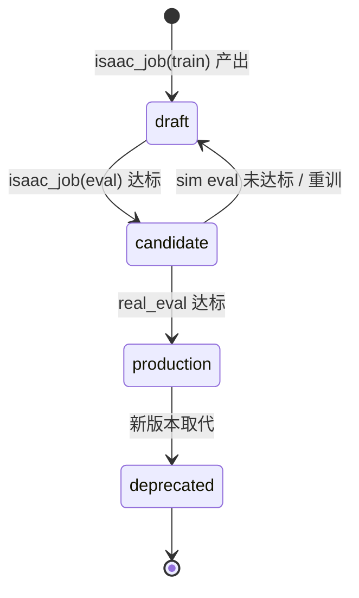

# PolicyArtifact 与策略注册规范 v1.0

| 属性 | 内容 |
|------|------|
| **文档编号** | TECH-12 |
| **版本** | v1.0 |
| **维护人** | P2 |
| **依据** | TECH-09 v1.0-approved §5.5、§8.8 |

---

## 一、 PolicyArtifact 组成

```text
artifacts/policies/{policy_id}/
├── policy_manifest.yaml      # 契约核心（本规范）
├── checkpoints/
│   ├── best.pt               # 或 best.onnx
│   └── last.pt
├── metrics_summary.json      # 训练/eval 摘要
└── producer_run.json         # {"isaac_job_id": "...", "kind": "train"}
```

checkpoint **不经 ROS2 传输**；ws-02 → ws-01/onboard 文件同步后，deploy 节点本地加载。

---

## 二、 policy_manifest.yaml 字段

```yaml
policy_id: pol_20260610_velocity_go2_v1
lifecycle_status: candidate       # draft | candidate | production | deprecated

# 血缘
source_isaac_job_id: isaac_20260610_143000_p2_train
git_commit: a1b2c3d4e5f6
created_at: "2026-06-10T15:00:00+08:00"
owner: p2
project_id: lab-default

# 任务语义
task_id: velocity_rough_go2
task_domain: locomotion           # manipulation | locomotion | navigation | loco_manipulation
eval_protocol_id: loco_vel_v1     # sim/real 共用

# 模型文件
checkpoint:
  path: checkpoints/best.pt
  format: torchscript               # pt | torchscript | onnx
  sha256: "..."

# Sim↔Real 接口对齐（语义级，Topic 见 ros2_interface_v1）
observation_schema:
  version: "1.0"
  fields:
    - name: base_lin_vel
      shape: [3]
      dtype: float32
      source: /perception/robot_state
    - name: joint_pos
      shape: [12]
      dtype: float32
      source: /perception/joint_states

action_schema:
  version: "1.0"
  fields:
    - name: joint_target_pos
      shape: [12]
      dtype: float32
      target: /skill/intent

# onboard 加载
onboard_runtime:
  engine: onnx                    # onnx | torchscript | native_pt
  node: policy_runner_low
  max_inference_hz: 100

# 兼容设备
supported_devices: [quadruped-01]   # 或 ["*"] 实验室通用（需 CR 批准）

# 部署约束
deploy_constraints:
  max_speed_cap: 1.0              # 不得超过 device max_speed_cap
  min_bridge_level: L3
  requires_calibrations: [imu, joint_zero]

# 指标摘要（来自 train/eval）
metrics:
  sim_eval_success_rate: 0.92
  source_eval_artifact_id: eval_20260610_loco_vel_v1_001
```

---

## 三、 lifecycle 状态机



| 状态 | 允许操作 |
|------|----------|
| **draft** | `isaac_job(play/eval)`；不可 `real_deploy` |
| **candidate** | + `real_deploy`（低速 smoke）；不可正式 `real_eval` 对外 |
| **production** | 全速 `real_eval`、对外汇报 |
| **deprecated** | 只读；PreFlight PF-13 拒绝新 deploy |

**晋升 API**（IndexService / 脚本）：

```bash
lab policy promote --id pol_xxx --to candidate --eval eval_xxx
lab policy promote --id pol_xxx --to production --eval eval_yyy
lab policy deprecate --id pol_xxx --successor pol_yyy
```

---

## 四、 自动注册（isaac_job train 结束）

`isaac_job_adapter` 扫描 native 输出目录，若发现 checkpoint：

1. 生成 `policy_id`
2. 从 train config + task_manifest 填充 manifest 基础字段
3. 设置 `lifecycle_status: draft`
4. 写入 ArtifactRegistry + 关联 `isaac_job_id`

eval 结束后若 metrics 达阈值（`eval_protocol` 定义），可自动 promote → `candidate`。

---

## 五、 real_deploy 加载流程

```
1. PreFlight PF-12/13 校验 manifest
2. 文件同步 checkpoint 至 onboard 缓存目录
3. F6C policy_runner_low 按 onboard_runtime 加载
4. F6B 按 observation_schema 订阅 Perception Topic
5. action_schema 编码为 SkillIntent 发布
```

---

## 六、 metrics_summary.json

```json
{
  "policy_id": "pol_20260610_velocity_go2_v1",
  "train": {
    "isaac_job_id": "isaac_20260610_143000_p2_train",
    "final_reward": 842.1,
    "iterations": 5000
  },
  "sim_eval": {
    "eval_artifact_id": "eval_20260610_loco_vel_v1_001",
    "success_rate": 0.92,
    "episodes": 100
  },
  "real_eval": null
}
```

---

*TECH-12 | policy_registry_spec v1.0*
