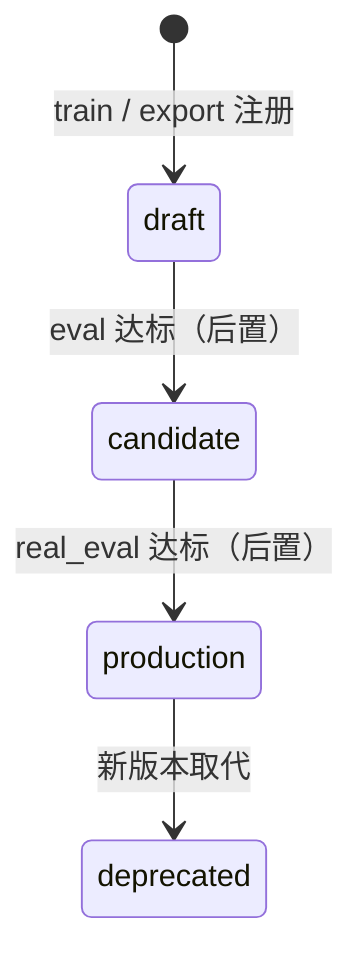

# Policy / Dataset 注册规范 v1.2

| 属性 | 内容 |
|------|------|
| **文档编号** | TECH-12 |
| **版本** | v1.2 |
| **日期** | 2026-08-07 |
| **维护人** | R2 |
| **依据** | TECH-09 · [PLAN-STRUCT-01](../plan/lab_strategy_runtime_structure_v0.md) §5.4 / P5 · [TECH-05](./run_id_spec.md) |
| **实现** | `lab_platform/artifacts/hub.py`（`ArtifactHub`）· CLI：`lab data export` / `lab policy train` |

---

## 0. 两种形态（必读）

| 形态 | 状态 | 说明 |
|------|------|------|
| **A. CTRL-SIM MVP（当前）** | **已落地** | `lerobot_state` numpy MLP；`policy.npz`；dataset=`ds_*`；默认 Index 注册 |
| **B. 目标态（Isaac train / 真机 deploy）** | 设计保留 | `checkpoints/best.pt`、promote API、onboard 加载——见 §五 |

下文 **§一–§四以 A 为准**；§五保留 B 作为演进契约，不覆盖 MVP。

---

## 一、 DatasetArtifact（MVP）

### 1.1 ID

`ds_<source_run_id>`（`-` → `_`），由 `make_dataset_id` 生成；overwrite 后 **upsert**。

### 1.2 落盘

```text
<data-root>/datasets/lerobot_v3/<run_id>/
├── meta/
│   ├── info.json
│   ├── lab_source.json      # dataset_id + source_run_id
│   ├── lab_dataset.json     # Index 旁路镜像（注册时写）
│   └── ...
└── data/chunk-000/file-000.parquet
```

### 1.3 注册

`lab data export --format lerobot-v3` **默认注册**（`--no-register` 退出）：

1. 写源 run `manifest.tracks.B.dataset_id`
2. `IndexService.upsert_artifact(type=dataset)`
3. `link_run_artifact(source_run, ds_*, downstream)`

解析：`ArtifactHub.resolve_dataset_root(path | ds_*)`。

---

## 二、 PolicyArtifact（MVP · lerobot_state）

### 2.1 目录

```text
<data-root>/artifacts/policies/{policy_id}/
├── policy.npz                 # 权重（当前唯一必需 checkpoint）
├── policy.meta.json           # 训练 meta 旁路
├── train_meta.json
├── hub_meta.json              # 注册摘要
└── policy_manifest.yaml       # 契约核心（见下）
```

示例 id：`pol_state_p4_mvp` 或 `pol_{YYYYMMDD_HHMMSS}_{slug}`。

### 2.2 policy_manifest.yaml（MVP 最小集）

```yaml
policy_id: pol_state_p4_mvp
lifecycle_status: draft          # draft | candidate | production | deprecated
backend: lerobot_state
checkpoint:
  path: policy.npz
  format: lab_numpy_mlp_v0
source_dataset_ids:
  - ds_cs_20260806_174016_p2_franka_01
created_at: "2026-08-07T00:00:00+08:00"
supported_devices: [franka-01]
task_domain: manipulation
```

### 2.3 注册与解析

`lab policy train …` **默认注册**（`--no-register` 退出）：

1. 规范拷贝到 `artifacts/policies/<policy_id>/`
2. upsert `type=policy`；metadata 含 `source_dataset_ids`
3. 链到各源 dataset 的 producer run（downstream）

解析：`ArtifactHub.resolve_policy_checkpoint(path | policy_id)` → `policy.npz`。

Rollout：

```bash
lab policy rollout --checkpoint pol_state_p4_mvp
# 或
lab ctrl-sim run --profile m5_policy_rollout --checkpoint pol_state_p4_mvp
```

成功后 rollout run manifest 写 `policy.policy_id`；Index：`link_run_artifact(rollout_run, pol_*, upstream)`。

### 2.4 观测 / 动作（与 Task Pack 对齐）

| 侧 | 内容 |
|----|------|
| observation | `q[7] + gripper_width` → `observation.state` `[8]` |
| action | `ee_delta[6] + gripper` → `action` `[7]` |

字段映射见 [DATA-MAP-01](./low_jsonl_to_lerobot_v3.md)。

---

## 三、 lifecycle（共用）



| 状态 | MVP 现状 |
|------|----------|
| **draft** | 训练默认；可 CTRL-SIM rollout |
| **candidate / production** | promote CLI **未实现**；真机前再开 |
| **deprecated** | 只读约定；PreFlight 拒新 deploy（真机期） |

---

## 四、 CLI 速查

```bash
lab --data-root <root> data export --run-id <cs_…> --format lerobot-v3
lab --data-root <root> policy train --dataset ds_… --policy-id pol_…
lab --data-root <root> list --artifacts
lab --data-root <root> lineage <run_id>
```

---

## 五、 目标态（历史设计 · Isaac / 真机 · 不覆盖 MVP）

> 以下为 TECH-09 原契约，供 Pipeline A train / onboard deploy 演进；**当前 CTRL-SIM 不强制此布局。**

```text
artifacts/policies/{policy_id}/
├── policy_manifest.yaml
├── checkpoints/
│   ├── best.pt
│   └── last.pt
├── metrics_summary.json
└── producer_run.json
```

目标态 manifest 可含 `observation_schema` / `action_schema` / `onboard_runtime` / `deploy_constraints`（Go2 locomotion 示例见 git 历史 v1.1）。

晋升 API（**未实现**）：

```bash
lab policy promote --id pol_xxx --to candidate --eval eval_xxx
lab policy deprecate --id pol_xxx --successor pol_yyy
```

`isaac_job(train)` 结束自动注册仍属目标态；现由 `lab policy train` + ArtifactHub 承担 MVP。

---

## 六、 变更记录

| 版本 | 日期 | 说明 |
|------|------|------|
| v1.0 / v1.1 | 2026-06 / 07 | Go2 / Isaac train 目标契约 |
| **v1.2** | **2026-08-07** | 对齐 ArtifactHub MVP；目标态降为 §五 |

---

*TECH-12 | policy_registry_spec v1.2*
