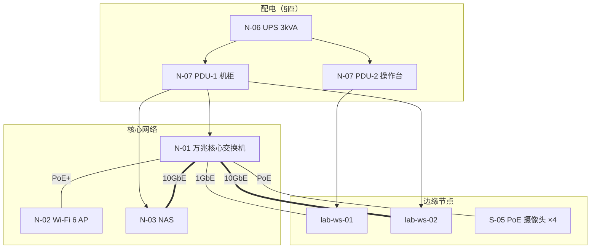
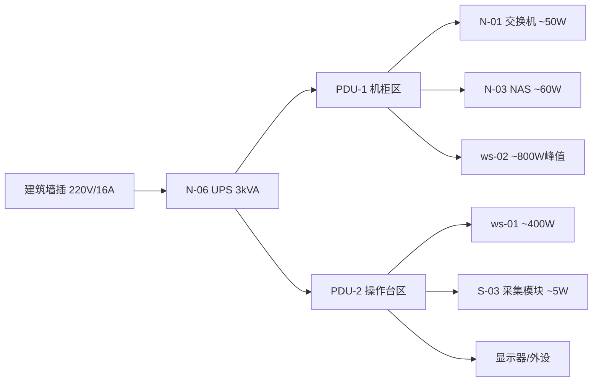

# 实验室弱电与配电连接设计方案 v1.0

| 属性 | 内容 |
|------|------|
| **文档编号** | LAYOUT-02 |
| **版本** | v1.0-draft |
| **日期** | 2026-07-09 |
| **维护人** | R3（现场）/ R2（网络配电） |
| **状态** | **草案 · 施工前须 R1 签字 + 现场实测复核** |
| **依据** | [PLAN-BUDGET-02 §2.1/§2.2](../plan/budget_v2_framework.md) · [LAYOUT-01](./layout_draft_v0.md) · [SFT-02 急停逻辑](../safety/estop_wiring_v1.md) · [TECH-03 网络规划](../infra/infra_plan_draft_v0.md) |
| **用途** | 支撑框架 BOM 采购与 **S-09 弱电/围栏施工** 外包招标；非高压配电设计（不改造建筑总配电箱） |

---

## 一、文档定位与 BOM 对照

本文件是 [budget_v2_framework.md](../plan/budget_v2_framework.md) §2.1、§2.2 的**电气层设计依据**。仓库内此前仅有：

| 已有文档 | 内容 | 缺口 |
|----------|------|------|
| [SFT-02 estop_wiring_v1.md](../safety/estop_wiring_v1.md) | 三级急停**逻辑**（软件/遥控/本体） | 无端子号、线径、继电器接线 |
| [LAYOUT-01 layout_draft_v0.md](./layout_draft_v0.md) | 平面分区与 E1/E2 **位置** | 无电缆路径与配电容量 |
| [TECH-03 infra_plan_draft_v0.md](../infra/infra_plan_draft_v0.md) | IP 与交换机拓扑 | 无 UPS/PDU 与 PoE 供电 |

**本文件补齐：** 配电单线图、急停硬接线图、网络/PoE 布线表、施工验收项。

### 1.1 BOM 条目映射

| BOM 序号 | 物品 | 本文件章节 |
|:--------:|------|------------|
| N-01～N-05 | 交换机、AP、NAS、网线 | §三 网络布线 · §四 配电 |
| N-06 | UPS 3kVA | §四 配电单线图 |
| N-07 | PDU/工业插排 ×2 | §四 配电单线图 |
| S-01 | 围栏 | §二 平面锚点 · §六 施工 |
| S-02 | 急停控制箱 ×2（E1/E2） | §五 急停电气接线图 |
| S-03 | 信号采集模块 | §五 急停电气接线图 |
| S-05 | PoE 摄像头 ×4 | §三 网络布线 |
| S-09 | 弱电施工劳务 | §六～§七 |

---

## 二、设计假设与平面锚点

> **W1 后待办：** R3 进场实测后更新线缆长度（表中为 80㎡ 示意房间估算）。

| 项 | 假设值 | 备注 |
|----|--------|------|
| 房间面积 | 约 10 m × 8 m | 见 LAYOUT-01 |
| 建筑插座 | 已有 **220 V / 16 A** 墙插 ≥4 处 | 本设计**不新增配电箱**，仅通过 UPS/PDU 分配 |
| 实验网段 | 192.168.42.0/24 | 与 TECH-03 一致 |
| 动态区 | Z-DYN，围栏内约 6 m × 5 m | S-01 |
| E1 位置 | Z-OP 操作台旁（lab-ws-01 侧） | 主急停 |
| E2 位置 | 围栏安全门入口 | 副急停 |
| 采集主机 | lab-ws-01（192.168.42.11） | S-03 USB 接入 |

### 2.1 设备平面锚点（施工放线用）

```text
                    [大门]
                      |
    +-----------------+------------------+
    |  Z-STORE        |                  |
    |                 |    Z-DYN         |
    |  [机柜+UPS]     |    (围栏内)      |
    |  [NAS]          |                  |
    |  [ws-02]        |                  |
    |  [ws-01]--(E1)  |==(门)==(E2)      |
    |  Z-OP           |                  |
    +-----------------+------------------+
         PoE CAM ×4（顶角/围栏外高位）
         AP：房间中心顶装
```

---

## 三、网络与弱电布线

### 3.1 逻辑拓扑（与 BOM N-01～N-05 一致）



### 3.2 线缆清单（建议采购量，含 N-05）

| 线缆编号 | 类型 | 规格 | 估算长度 | 用途 | 端接 |
|:--------:|------|------|:--------:|------|------|
| C-01 | 六类/超六类网线 | Cat6A，万兆 | 15 m ×2 | ws-02↔交换机、NAS↔交换机 | RJ45 |
| C-02 | 六类网线 | Cat6 | 8 m | ws-01↔交换机 | RJ45 |
| C-03 | 六类网线 | Cat6 | 20 m | AP↔交换机（顶装） | RJ45 |
| C-04 | 六类网线 | Cat6 | 4×12 m | 摄像头↔交换机 | RJ45 |
| C-05 | 多芯信号线 | RVV 4×0.75 mm² | 25 m | E1↔E2 串联至采集箱 | 压接端子 |
| C-06 | USB 线 | 屏蔽 USB2.0，≤5 m | 3 m | 采集模块↔ws-01 | USB-A |
| C-07 | 电源线 | 3×1.5 mm² | 按需 | UPS 输入（配 16 A 插头） | 电工敷设 |

**走线原则：**

- C-01/C-02 贴地线槽或沿墙线槽，与动力电缆分隔 ≥30 cm。
- C-04 摄像头线沿顶角或围栏上沿走线，避免与机器人运动区交叉。
- C-05 **弱电专用**，不与 220 V 同管。

### 3.3 PoE 摄像头（S-05 ×4）

| 摄像头 | 建议位置 | 交换机端口 | 供电 |
|--------|----------|------------|------|
| CAM-01 | Z-DYN 对角高位，俯视并发位 1 | SW PoE 口 1 | 802.3af |
| CAM-02 | Z-DYN 对角高位，俯视并发位 2 | SW PoE 口 2 | 802.3af |
| CAM-03 | 安全门 E2 外侧 | SW PoE 口 3 | 802.3af |
| CAM-04 | Z-OP 操作台全景 | SW PoE 口 4 | 802.3af |

**验收：** 4 路 RTSP 在 ws-01 可拉流；夜视可选。

---

## 四、配电单线图（N-06、N-07）

> 本实验室机器人**电池供电**，配电仅服务 IT 设备、弱电与围栏周边，**不**向机器人动力供电。



### 4.1 负荷估算

| 负载 | 典型功耗 | 峰值 | 接电 |
|------|:--------:|:----:|------|
| ws-02（5090D 训练） | 400 W | **650 W** | PDU-1 |
| ws-01（4070Ti 控制） | 250 W | 400 W | PDU-2 |
| 交换机 + NAS + AP | 120 W | 150 W | PDU-1 |
| PoE 摄像头 ×4 | 40 W | 60 W | 交换机 PoE |
| 采集模块 + 急停箱（继电器线圈） | 10 W | 15 W | PDU-2 |
| **合计（峰值）** | | **~1.3 kW** | UPS 3 kVA 余量充足 |

### 4.2 配电施工要求

1. UPS 输入接**独立 16 A 回路**墙插，不与空调/电暖共用。
2. PDU-1 置于 19" 机柜（S-08）或 ws-02 机柜侧；PDU-2 置于 ws-01 操作台下方。
3. 机柜内设备**统一接地**，接地电阻按建筑规范（一般 ≤4 Ω）。
4. 施工后贴 **回路标识**：`IT-UPS-01`、`Z-OP-02`。

---

## 五、急停电气接线图（S-02 ×2 + S-03）

### 5.1 设计原则

| 原则 | 说明 |
|------|------|
| 常闭串联 | E1、E2 蘑菇头 **NC（常闭）** 触点串联，正常时回路导通 |
| 双线制 | 不使用强电直接控制机器人；仅 **24 V 弱电** 或干接点 |
| 故障安全 | 断线、松脱视为急停触发（开路 = ESTOP） |
| 与软件解耦 | 硬件回路状态由 S-03 读入，经 ROS2 广播（见 SFT-02） |

### 5.2 推荐器件配置（单套 S-02 急停箱）

| 位号 | 器件 | 规格 | 数量/箱 |
|------|------|------|:-------:|
| SB | 蘑菇头急停按钮 | 22 mm，**1NO+1NC**，旋转复位 | 1 |
| K | 中间继电器 | 24 VDC 线圈，2CO 或 1NO+1NC | 1 |
| PS | 开关电源 | 24 V / 0.5 A（箱内） | 1 |
| TB | 接线端子排 | 导轨式 | 1 组 |

### 5.3 急停硬接线原理图

```text
                    [E1 急停箱]              [E2 急停箱]
                    SB1(NC)                  SB2(NC)
                       |                        |
    +24V ---+----------+----(串联 NC 链)--------+-----> 至采集箱 INPUT
            |                                   |
           GND <---------------------------------+-----> 公共回线

    采集箱内（S-03，示例：USB 8 路干接点模块）:
    INPUT_CH0 <--- E1/E2 串联回路（开路=急停）
    模块 USB ---> lab-ws-01

    可选（继电器扩展）:
    K1 线圈并联监测 / 或驱动声光报警
```

### 5.4 端子接线表

| 端子 | 来源 | 去向 | 线色建议 |
|------|------|------|----------|
| TB-E1-1 | PS +24V | SB1 常闭触点入 | 红 |
| TB-E1-2 | SB1 常闭触点出 | 至 E2 箱入线 | 红 |
| TB-E2-1 | E1 来线 | SB2 常闭入 | 红 |
| TB-E2-2 | SB2 常闭出 | C-05 至采集箱 CH0 | 红 |
| TB-GND | PS 0V | 采集箱 COM | 蓝 |
| USB | S-03 模块 | ws-01 后面板 USB | — |

**线长（估算）：** E1↔E2 围栏门边约 8～12 m（C-05）；E2↔采集箱约 5 m。

### 5.5 软件映射（施工后 R2 配置）

| 硬件状态 | 采集模块读数 | ROS2 行为 |
|----------|--------------|-----------|
| 回路闭合（正常） | CH0 = 导通 / 高电平 | `/safety/global_state` → OK |
| 任急停拍下或断线 | CH0 = 开路 / 低电平 | 广播 **ESTOP**，BU-05 验收项 |

配置细节见 [INFRA-02](../infra/phase1_validation_plan_v1.md) E7、BU-05；**真机动态实验前**须完成本回路实测。

---

## 六、施工分工与 S-09 外包范围

### 6.1 承包范围（建议写入外包合同）

| 包含 | 不包含 |
|------|--------|
| 围栏 S-01 安装、安全门闭合检测（机械） | 建筑强电改造、新增配电箱 |
| E1/E2 箱体固定、C-05 弱电敷设、端子接线 | ws-01/ws-02 系统安装 |
| 线槽/理线、机柜 PDU 安装 | 机器人本体接线 |
| PoE 摄像头支架安装与 C-04 布线 | NAS/交换机配置（R2 负责） |
| AP 顶装馈线 C-03 | |

### 6.2 施工顺序

```text
1. 弹线定位（E1/E2/机柜/摄像头） → R3 + 施工方
2. 围栏主体安装（S-01）          → 施工方
3. 线槽与 C-01～C-05 敷设        → 施工方
4. 急停箱接线与通断测试（§7.1）  → 施工方 + R3
5. UPS/PDU 上电（§7.2）          → R2 + R3
6. 网络设备上架与 IP 配置         → R2
7. ROS2 急停联调（BU-05）         → R2
```

---

## 七、验收检查表

### 7.1 急停硬接线（P0，动态实验门禁）

| # | 检查项 | 方法 | 通过标准 |
|---|--------|------|----------|
| 1 | E1 单拍 | 万用表 / 采集模块 | CH0 开路，ws-01 读 ESTOP |
| 2 | E2 单拍 | 同上 | 同上 |
| 3 | 复位后 | 旋转复位 | CH0 恢复闭合，软件解除 ESTOP |
| 4 | 模拟断线 | 拔掉 C-05 任一端 | 视为 ESTOP（故障安全） |
| 5 | 标识 | 目视 | E1/E2 贴中英文「急停」标签 |

### 7.2 配电与网络（P0）

| # | 检查项 | 通过标准 |
|---|--------|----------|
| 1 | UPS 切换 | 断墙插 10 s 内 IT 设备不掉电 |
| 2 | 万兆链路 | ws-02 ↔ NAS `iperf3` ≥5 Gbps |
| 3 | PoE | 4 路摄像头同时上电 |
| 4 | 接地 | 机柜接地线可靠连接 |

### 7.3 签字

| 角色 | 姓名 | 日期 | 结论 |
|------|------|------|------|
| R3（现场） | | | |
| R2（网络/采集） | | | |
| R1（批准） | | | |

---

## 八、变更与实测待办

| 项 | 责任人 | 目标周 |
|----|--------|--------|
| 实测房间尺寸，更新 §二 线缆长度 | R3 | W2 |
| 确认建筑插座位置与容量 | R3 | W2 |
| 选定 S-02/S-03 具体型号，补物料编码 | R3 | W3 下单前 |
| 施工后升版 **v1.0**（实测图替换示意） | R3 | W8 |

---

## 九、相关文档

| 文档 | 关系 |
|------|------|
| [PLAN-BUDGET-02](../plan/budget_v2_framework.md) | BOM 来源 |
| [SFT-02](../safety/estop_wiring_v1.md) | 急停三级逻辑 |
| [SFT-01](../safety/safety_sop_v1.md) | 操作规程 |
| [LAYOUT-01](./layout_draft_v0.md) | 平面分区 |
| [TECH-03](../infra/infra_plan_draft_v0.md) | IP/VLAN |

---

*LAYOUT-02 | 弱电与配电连接设计 · 支撑 PLAN-BUDGET-02 §2.1/§2.2*
