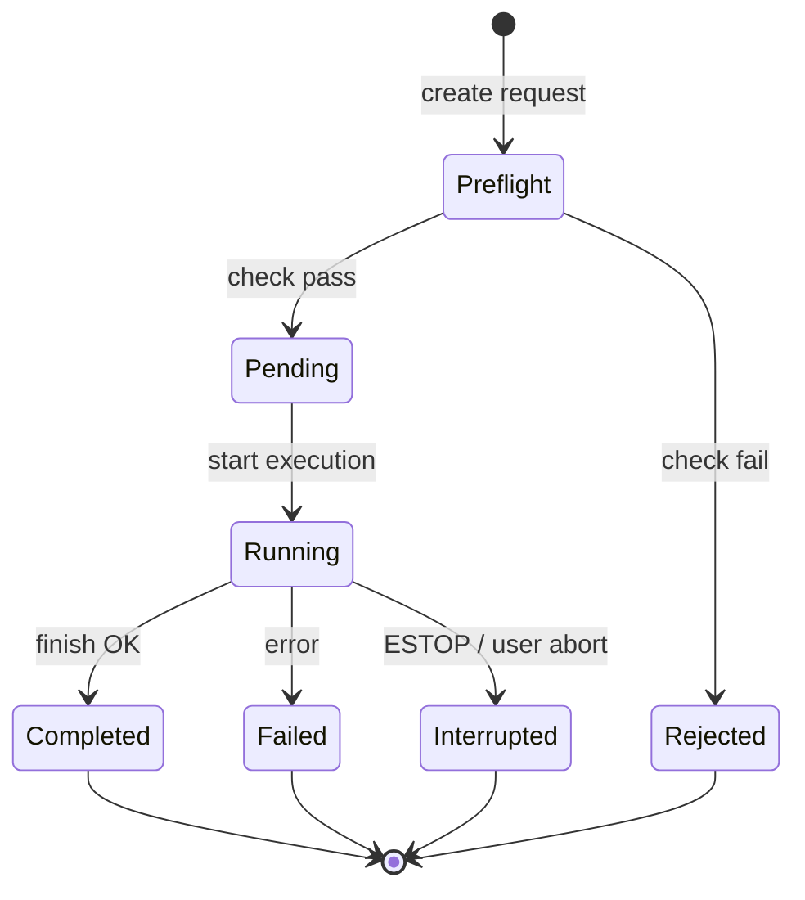

# F7 RunManager 模块详细设计 v1.0

| 属性 | 内容 |
|------|------|
| **模块** | F7 · RunManager |
| **版本** | v1.0-draft |
| **维护人** | P2 |
| **依据** | TECH-09 v1.0-approved §三 F7、§八；TECH-05、TECH-10 |

---

## 一、 职责边界

| 负责 | 不负责 |
|------|--------|
| Run 生命周期（create → running → finish） | Perception / Plan / Policy 推理 |
| 调用 PreFlightGate | Isaac 训练逻辑 |
| 调用 ResourceScheduler acquire/release | Driver SDK 封装 |
| 发布 `/system/run_context`（Pipeline B） | rosbag 编解码细节 |
| 触发 RosbagRecorder start/stop | IndexService 存储引擎选型以外的 schema |

**部署**：`lab-ws-01`（ROS2 节点 + CLI）；Pipeline A 的 create/finish 也可在 ws-02 本地 CLI 调用 IndexService API。

---

## 二、 组件结构

```text
lab_platform/run_manager/
├── __init__.py
├── cli.py                 # lab run create|finish|list|status
├── node.py                # ROS2 RunManagerNode (Pipeline B)
├── lifecycle.py           # RunLifecycleStateMachine
├── preflight/             # 见 preflight_checklist_spec
│   ├── gate.py
│   └── checks/            # PF-01 .. PF-15
├── scheduler/             # ResourceScheduler client
│   └── locks.py
├── context_publisher.py   # /system/run_context
└── rosbag_hooks.py        # 通知 RosbagRecorder
```

---

## 三、 状态机



**任何终态**必须 release resource_locks。

---

## 四、 核心接口

### 4.1 CLI

```bash
lab run create --type real_deploy \
  --device quadruped-01 \
  --policy pol_xxx \
  --plan exp_xxx

lab run start --id rd_xxx      # 发布 run_context，启动 rosbag
lab run finish --id rd_xxx --status completed
lab run abort --id rd_xxx --reason "ESTOP"
lab run list --type real_deploy --limit 20
```

### 4.2 Python API

```python
class RunManager:
    def create(self, request: RunCreateRequest) -> RunRecord: ...
    def start(self, run_id: str) -> None: ...
    def finish(self, run_id: str, status: RunStatus, result: dict | None) -> None: ...
```

### 4.3 ROS2（Pipeline B）

| Topic/Service | 方向 | 说明 |
|---------------|------|------|
| `/system/run_context` | ws-01 pub | 当前 active run_id, device_ids, policy_id |
| `/system/run_command` | service | onboard 查询 run 是否 active |
| `/system/health` | ws-01 + onboard pub | LabOpsMonitor 消费 |

msg 定义待 `ros2_interface_v1.md`；RunManager 只依赖 **run_id + device_ids + policy_id** 最小字段。

---

## 五、 PreFlight 集成

```
create() 流程:
  1. 组装 RunRequest
  2. preflight_gate.check(request)
  3. 若 fail → 写 audit log，抛 RunRejectedError
  4. scheduler.acquire(request)  # 已在 PF-07/08 内或紧随其后
  5. 生成 run_id，创建目录（run_id_spec §四）
  6. 写 metadata.json (status=pending)
  7. index_service.register_run()
  8. 返回 RunRecord
```

检查项实现见 `preflight_checklist_spec.md`；每项独立 `Check` 类，便于单测。

---

## 六、 ResourceScheduler 集成

```python
class ResourceScheduler:
    def acquire(self, run_request) -> list[Lock]:
        """device_lock, zone_lock, gpu_lock 按 run_type 规则获取"""

    def release(self, run_id: str) -> None:
        """finish/abort/TTL 时释放"""

    def list_active(self) -> list[Lock]:
        """LabOps 查询 Z-DYN 当前占用"""
```

**zone_lock 规则**：Z-DYN 已有 2 个 device_lock 时，第 3 个 PreFlight PF-07 fail（或可选 queue，首版 **fail**）。

---

## 七、 Rosbag 钩子

```
start(run_id):
  → publish run_context
  → rosbag_recorder.start(run_id, topics=task_manifest.record_topics)

finish(run_id):
  → rosbag_recorder.stop()
  → cron/立即触发归档至 ws-02 runs/.../rosbags/
  → 更新 metadata.ended_at
```

---

## 八、 非功能

| 项 | 目标 |
|----|------|
| create → start 延迟 | < 2s（不含 PreFlight 外部 IO） |
| 崩溃恢复 | ws-01 重启后扫描 status=running，标记 interrupted + release locks |
| 审计 | 所有 reject/finish 写 structlog JSON |

---

## 九、 测试计划

| 用例 | 验证 |
|------|------|
| PreFlight PF-02 blocked device | create 拒绝 |
| Z-DYN 第 3 台并发 | PF-07 fail |
| deploy 无 candidate policy | PF-13 fail |
| finish 后 lock 释放 | resource_locks 表空 |
| interrupt ESTOP | status=interrupted, safety_events 写入 |

---

## 十、 依赖与顺序

1. **先实现**：IndexService API、PreFlight checks、ResourceScheduler
2. **后接入**：RosbagRecorder、ROS2 run_context
3. **Real 栈 MDD** 定义 run_context msg 后联调

---

*MDD-F7-RM | F7_run_manager_mdd_v1*
