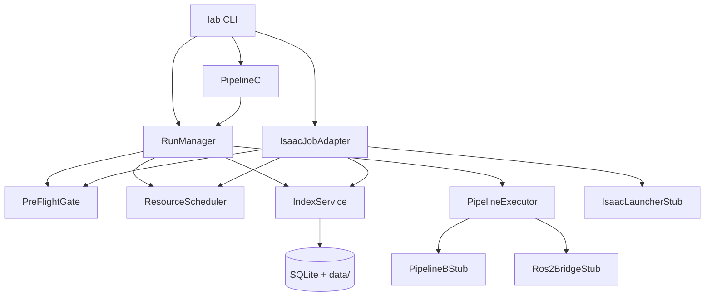

# 平台框架 Walking Skeleton 设计 v1.0

| 属性 | 内容 |
|------|------|
| **版本** | v1.0 |
| **策略** | 先打通 Pipeline 接口，模块内部用 Stub 代替 |
| **依据** | TECH-09 v1.0-approved · MDD 索引 |

---

## 一、 为何可行

| 传统做法 | Walking Skeleton |
|----------|------------------|
| 逐模块深挖再集成 | 先定 **模块边界 + 调用顺序 + 数据契约** |
| 集成阶段才发现接口不一致 | 第一天即可跑通 **isaac → real** 全链路 |
| 并行开发缺少联调基准 | Stub 即 **Mock 契约**，替换 Stub = 模块完成 |

**原则**：
- **真实**：IndexService（SQLite）、目录结构、Run ID、PreFlight 流程、Lock 语义
- **Stub**：Isaac subprocess、ROS2、Driver Bridge、Teleop、Policy 推理

---

## 二、 模块与接口层



### 接口清单（`lab_platform/protocols.py`）

| Protocol | 实现（骨架期） | 后续替换 |
|----------|----------------|----------|
| `IndexClient` | `IndexService` SQLite | 可换 HTTP 远程 |
| `PreFlightGate` | `DefaultPreFlightGate` 读 yaml | 补全 PF-01..15 |
| `ResourceScheduler` | `SqliteResourceScheduler` | 同上 |
| `IsaacLauncher` | `StubIsaacLauncher` sleep+假 checkpoint | 真 Isaac CLI |
| `RealRuntime` | `StubRealRuntime` 打印+假 rosbag | F5/F6 ROS2 |
| `Ros2Bridge` | `StubRos2Bridge` 打印 run_context | 真 ROS2 节点 |
| `PipelineExecutor` | 按 run_type 分发 Stub | 真运行时 |

---

## 三、 全流程（可 `lab demo full` 一键跑通）

```
① lab init
② Pipeline C: real_bringup(franka-01)           → Bridge L1
③ Pipeline C: calibration_session(franka-01)   → CalibrationArtifact
④ [手动] bridge promote L2/L3/L4 或 demo 脚本提升
⑤ Pipeline B: real_collect(franka-01)          → DemoArtifact
⑥ Pipeline A: isaac_job(train) + DemoArtifact  → PolicyArtifact(draft)
⑦ Pipeline A: isaac_job(eval)                  → EvalArtifact, policy→candidate
⑧ Pipeline B: real_deploy + PolicyArtifact
⑨ Pipeline B: real_eval + scene + protocol     → EvalArtifact(real)
⑩ sim2real_gap_job                             → gap_report
```

每步均：PreFlight → Lock → 建目录 → Stub 执行 → 注册 Artifact → Release Lock。

---

## 四、 目录与包结构

```text
lab_platform/
├── pyproject.toml
├── README.md
└── lab_platform/
    ├── cli.py
    ├── config.py
    ├── models.py
    ├── protocols.py
    ├── index/          # 真实索引
    ├── preflight/
    ├── scheduler/
    ├── run_manager/
    ├── pipelines/      # A/B/C + gap
    └── stubs/          # 可替换假实现
data/                   # lab init 创建
└── registry/
```

---

## 五、 并行开发切分

| 开发者 | 替换目标 | 不动 |
|--------|----------|------|
| F7 | IndexService 性能/HTTP | RunManager 调用方式 |
| Isaac | `StubIsaacLauncher` | adapter 收录逻辑 |
| Real F5 | `StubRealRuntime.collect` | Run 目录契约 |
| Real F6 | `StubRealRuntime.deploy/eval` | PreFlight PF-12 |
| R3 | `data/registry/*.yaml` | PreFlight 读接口 |
| Pipeline C | bringup 检查 BU-01..06 | Run 登记流程 |

---

## 六、 验收标准（骨架期）

- [ ] `lab init && lab demo full` 零报错跑完
- [ ] `data/index.db` 含完整 Run/Artifact 血缘
- [ ] `data/runs/` 与 `data/artifacts/` 目录符合 TECH-05
- [ ] 第 3 台 Z-DYN 并发 deploy 被 PreFlight 拒绝
- [ ] 单独替换 `StubIsaacLauncher` 不影响 RunManager

---

*framework_skeleton_design_v1*
