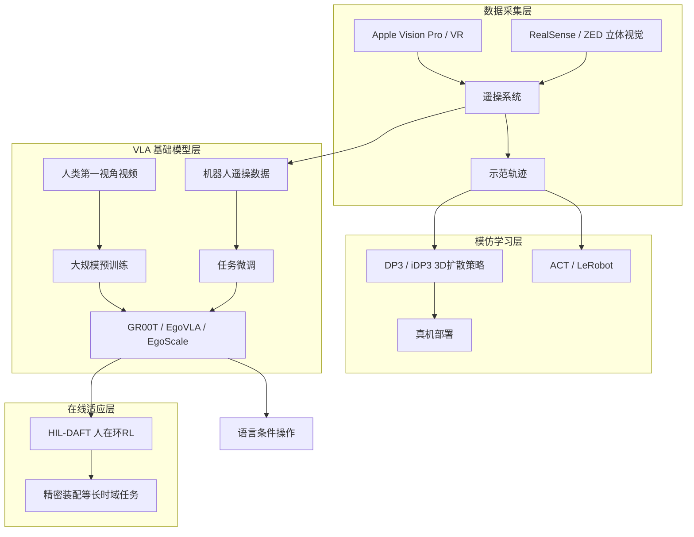

# 技术路线图：从 XR 遥操到人形 VLA

## 总体架构

## 15 篇博客索引

| # | 标题 | CSDN 链接 | 主题标签 | 核心论文/资源 |
|---|------|-----------|----------|---------------|
| 1 | 斯坦福通用人形策略 iDP3 | [143180794](https://blog.csdn.net/v_JULY_v/article/details/143180794) | iDP3 原理 | arXiv:2410.10803, 2403.03954 |
| 2 | iDP3 Learning 代码解析 | [145183110](https://blog.csdn.net/v_JULY_v/article/details/145183110) | 源码 | Improved-3D-Diffusion-Policy |
| 3 | iDP3 训练与部署代码解析 | [145260121](https://blog.csdn.net/v_JULY_v/article/details/145260121) | 源码 | vis_dataset / train / deploy |
| 4 | iDP3 人形遥操代码分析 | [145347655](https://blog.csdn.net/v_JULY_v/article/details/145347655) | 遥操 | Humanoid-Teleoperation |
| 5 | Fourier-Lerobot 封装 iDP3 | [146448646](https://blog.csdn.net/v_JULY_v/article/details/146448646) | 工程 | FFTAI/fourier-lerobot |
| 6 | UCSD 遥操发展史 | [140384810](https://blog.csdn.net/v_JULY_v/article/details/140384810) | 遥操 | AnyTeleop, Open-TeleVision |
| 7 | Open-TeleVision 源码解析 | [147183534](https://blog.csdn.net/v_JULY_v/article/details/147183534) | 源码 | OpenTeleVision/TeleVision |
| 8 | 宇树 VR 遥操与 IL | [147216841](https://blog.csdn.net/v_JULY_v/article/details/147216841) | 工程 | unitree_IL_lerobot, avp_teleoperate |
| 9 | Helix（Figure 02 VLA） | [145773235](https://blog.csdn.net/v_JULY_v/article/details/145773235) | VLA | Figure Helix + HiRT |
| 10 | 一文通透 GR00T N1 | [146376514](https://blog.csdn.net/v_JULY_v/article/details/146376514) | VLA | arXiv:2503.14734 |
| 11 | EgoVLA | [150402917](https://blog.csdn.net/v_JULY_v/article/details/150402917) | 人类视频 | arXiv:2507.12440 |
| 12 | GR00T N1.5 简介与微调 | [151907116](https://blog.csdn.net/v_JULY_v/article/details/151907116) | VLA | NVIDIA GEAR blog |
| 13 | EgoScale | [158574747](https://blog.csdn.net/v_July_v/article/details/158574747) | 人类视频 | arXiv:2602.16710 |
| 14 | HIL-DAFT | [159052965](https://blog.csdn.net/v_JULY_v/article/details/159052965) | RL 微调 | arXiv:2509.13774 |
| 15 | GR00T N1.7 简介与微调 | [161454543](https://blog.csdn.net/v_JULY_v/article/details/161454543) | VLA | EgoScale + Cosmos-Reason2 |

## 技术演进时间线

| 时间 | 里程碑 | 意义 |
|------|--------|------|
| 2023 | AnyTeleop (RSS) | 通用视觉遥操 + dex-retargeting |
| 2024.07 | Open-TeleVision (CoRL) | 沉浸式立体视觉遥操，宇树 H1 / 傅利叶 GR1 |
| 2024.10 | iDP3 | 以自我中心 3D 表征实现人形泛化操作 |
| 2025.02 | Helix (Figure) | 首个全身上半身 VLA，双系统架构 |
| 2025.03 | GR00T N1 | 开源人形 VLA 基础模型（Eagle-2 + DiT） |
| 2025.06 | GR00T N1.5 | 冻结 VLM、Eagle 2.5、FLARE、DreamGen |
| 2025.07 | EgoVLA | 人类第一视角视频预训练 + 少样本机器人微调 |
| 2025.09 | HIL-DAFT | 双 Actor 人在环 RL 微调 VLA |
| 2026.02 | EgoScale | 2 万小时人类视频 + 灵巧操作缩放定律 |
| 2026.04+ | GR00T N1.7 | EgoScale 预训练 + Cosmos-Reason2 + 商业许可 |

## 开源仓库速查

| 项目 | URL | 用途 |
|------|-----|------|
| iDP3 Learning | https://github.com/YanjieZe/Improved-3D-Diffusion-Policy | 3D 扩散策略训练部署 |
| iDP3 Teleop | https://github.com/YanjieZe/Humanoid-Teleoperation | AVP 全身遥操 |
| Open-TeleVision | https://github.com/OpenTeleVision/TeleVision | VR 遥操 + ACT |
| dex-retargeting | https://github.com/dexsuite/dex-retargeting | 人手→灵巧手重定向 |
| Fourier-Lerobot | https://github.com/FFTAI/fourier-lerobot | iDP3 + LeRobot |
| unitree_IL_lerobot | https://github.com/unitreerobotics/unitree_IL_lerobot | π0/ACT/DP + G1 |
| Isaac GR00T | https://github.com/NVIDIA/Isaac-GR00T | GR00T 微调部署 |
| EgoVLA | https://github.com/catburgg/EgoVLA | 人类视频 VLA |
