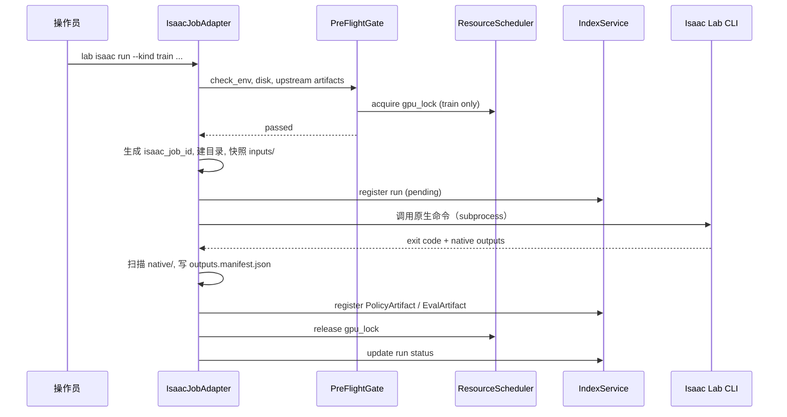

# Isaac Job 薄封装适配器规范 v1.0

| 属性 | 内容 |
|------|------|
| **文档编号** | TECH-13 |
| **版本** | v1.1 |
| **维护人** | R2 |
| **依据** | TECH-09 v1.0-approved §5.2、§6.1 |

---

## 一、 设计原则

| 做 | 不做 |
|----|------|
| 统一 CLI 入口 `lab isaac run` | 改写 Isaac Lab 训练循环 |
| 创建 `isaac_job_id`、快照 config | 替换 Isaac 环境/奖励定义 |
| PreFlight（GPU 锁 + check_env） | 在 ws-02 启动 ROS2 |
| 扫描产出、注册 PolicyArtifact / EvalArtifact | 经 DDS 传 checkpoint |

**部署**：仅 **lab-ws-02**，无 ROS2。

---

## 二、 CLI 接口

```bash
lab isaac run \
  --kind {play|train|eval} \
  --task <task_id> \
  [--config <path/to/train.yaml>] \
  [--policy <policy_id>] \
  [--demo <demo_id>] \
  [--eval-protocol <eval_protocol_id>] \
  [--operator p2] \
  [--project lab-default] \
  [--dry-run]
```

| 参数 | play | train | eval |
|------|:----:|:-----:|:----:|
| --task | ✓ | ✓ | ✓ |
| --config | 可选 | ✓ | 可选 |
| --policy | ✓ | 可选(IL) | ✓ |
| --demo | — | IL 时 ✓ | — |
| --eval-protocol | — | — | ✓ |

---

## 三、 执行流程



---

## 四、 原生命令映射（示例）

实际命令以 `version_matrix_v1.md` 锁定 Isaac Lab 版本为准；adapter 通过 `tasks/{task_id}/isaac_entry.yaml` 配置：

```yaml
# tasks/velocity_rough_go2/isaac_entry.yaml
train:
  cmd: ["python", "-m", "isaaclab.scripts.train", "--task", "Isaac-Velocity-Rough-Go2-v0"]
  cwd: "${ISAACLAB_ROOT}"
  env:
    ISAACSIM_PATH: "/opt/isaacsim"
eval:
  cmd: ["python", "-m", "isaaclab.scripts.eval", "--task", "Isaac-Velocity-Rough-Go2-v0"]
play:
  cmd: ["python", "-m", "isaaclab.scripts.play", "--task", "Isaac-Velocity-Rough-Go2-v0"]
output_scan:
  checkpoints_glob: "logs/**/checkpoints/best*.pt"
  metrics_glob: "logs/**/metrics.json"
```

adapter **不硬编码** Isaac 路径；缺失 entry 时 fail fast。

---

## 五、 产出收录规则

### train → PolicyArtifact

| 步骤 | 动作 |
|------|------|
| 1 | glob `output_scan.checkpoints_glob` |
| 2 | 复制/链接至 `artifacts/policies/{policy_id}/checkpoints/` |
| 3 | 生成 `policy_manifest.yaml`（lifecycle=draft） |
| 4 | 写 `producer_run.json` |
| 5 | IndexService 注册 + 关联 isaac_job downstream |

### eval → EvalArtifact

| 步骤 | 动作 |
|------|------|
| 1 | 读取 metrics.json |
| 2 | 写 `artifacts/evals/{eval_id}/eval_manifest.yaml` |
| 3 | 若达 protocol 阈值 → `lab policy promote --to candidate` |

### play

- 可选录屏至 `runs/isaac_jobs/{id}/logs/`
- 消费 PolicyArtifact，不产出新 policy（除非 fork 配置）

---

## 六、 outputs.manifest.json

```json
{
  "isaac_job_id": "isaac_20260610_143000_p2_train",
  "job_kind": "train",
  "native_exit_code": 0,
  "artifacts_registered": [
    {"type": "policy", "id": "pol_20260610_velocity_go2_v1", "path": "artifacts/policies/pol_..."}
  ],
  "native_output_root": "runs/isaac_jobs/isaac_.../native/"
}
```

---

## 七、 错误处理

| 场景 | 行为 |
|------|------|
| PreFlight fail | 不创建目录，exit 1 |
| Isaac subprocess 非零退出 | run status=failed，仍保留 logs/native 供 debug |
| 产出 glob 为空 | run status=failed，artifact 不注册 |
| GPU OOM | LabOpsMonitor 标记；gpu_lock release |

---

## 八、 与 F2/F3/F4 模块关系

| TECH-09 模块 | adapter 职责 |
|--------------|--------------|
| F2 SimLauncher | adapter 调起的 subprocess 即 SimLauncher |
| F3 Trainer | train kind 收录 checkpoint |
| F4 SimEvaluator | eval kind 收录 EvalArtifact |
| F7 IndexService | 所有 Run/Artifact 登记 |

详细类设计见 `docs/modules/isaac_job_adapter_mdd_v1.md`。

---

*TECH-13 | isaac_job_adapter_v1.0*
