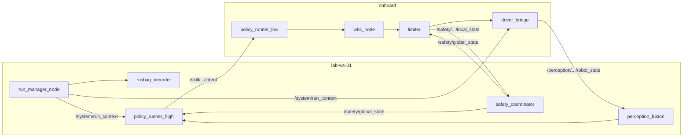

# 统一 ROS2 消息接口规范 v1.2

| 属性 | 内容 |
|------|------|
| **文档编号** | TECH-02 |
| **版本** | v1.2 |
| **维护人** | R2 |
| **依据** | [PLAN-FUSION-01](../plan/platform_wm_fusion_plan_v0.md) · [governance_index_v1.md](../org/governance_index_v1.md) · [TECH-09](../architecture/platform_technical_architecture_v1.md) · [TECH-12](../data/policy_registry_spec.md) · [version_matrix_v1.md](./version_matrix_v1.md) |
| **适用范围** | **Pipeline B/C**（Real 运行时）；Pipeline A（Isaac）**语义对齐但不跑 ROS2**（见 §3.3.1） |
| **主锚点设备** | `franka-01`（FR3）；`quadruped-01` 仍用既有 SkillIntent/cmd_vel |
| **实现包** | `embodied_lab_msgs`（自定义 msg/srv）· `embodied_lab_bringup`（launch） |

---

## 一、 设计边界

### 1.1 部署与 DDS 域

| 节点 | 是否进 ROS2 域 | 运行组件 |
|------|:-------------:|----------|
| **lab-ws-02** | **否** | Isaac、训练、IndexService、`lab isaac` CLI |
| **lab-ws-01** | **是** | RunManager、Rosbag、F5/F6B/F6S、Teleop |
| **机器人 onboard** | **是** | F6C、Limiter、Driver Bridge |

```text
ROS_DOMAIN_ID = 42          # 全实验室 Real 域统一
RMW_IMPLEMENTATION = rmw_cyclonedds_cpp   # 见 version_matrix §三
```

**禁止**：ws-02 启动任何 ROS2 节点；ws-01 **不得**跨网直接调用厂商 SDK（必须经 onboard Driver Bridge）。

### 1.2 控制环分层（§七）

| 环 | 频率 | 路径 | 跨网 Topic |
|----|------|------|------------|
| **慢环** | 10–50 Hz | ws-01 大脑：Perception 融合 → Plan → Policy(high) / Teleop | ✅ ws-01 ↔ onboard |
| **快环** | 100–500+ Hz | onboard：Policy(low) → WBC → Limiter → Driver Bridge | ❌ 仅 onboard 进程内（状态摘要上行） |

checkpoint / PolicyArtifact：**文件同步**加载，**不经 ROS2 传权重**（见 TECH-12）。

### 1.3 命名空间

```text
/{module}/{device_id}/{name}     # 设备相关
/system/{name}                   # 实验全局
/teleop/{name}                   # 示教输入（collect）
```

- `{device_id}` 必须与 `device_capabilities.yaml` / 资产台账一致（如 `quadruped-01`、`franka-01`）。
- **Topic/Service 路径**：ROS2 名段禁止 `-`；台账 `device_id` 中的 `-` 在 Topic 中映射为 `_`（如 `quadruped-01` → `/perception/quadruped_01/...`）。消息字段 `device_id` 仍用台账原值。
- 多设备时每个 device_id 独立子树，禁止混用。

---

## 二、 系统 Topic（Run 对齐 · LabOps）

RunManager 在 Pipeline B/C Run **start** 时发布，**finish/abort** 时清除。

### 2.1 `/system/run_context`

| 属性 | 值 |
|------|-----|
| **Message** | `embodied_lab_msgs/RunContext` |
| **Publisher** | `run_manager_node` @ ws-01 |
| **Subscriber** | 所有 Real 节点（onboard + ws-01） |
| **QoS** | Reliable, Transient Local, depth=1 |
| **频率** | 事件驱动（Run start/stop）+ 1 Hz 心跳 |

```text
# embodied_lab_msgs/msg/RunContext.msg
std_msgs/Header header
string run_id
string run_type              # real_collect | real_deploy | real_eval | real_bringup | calibration_session
string[] device_ids
string policy_id             # 空字符串表示无
string experiment_plan_id
string operator_id             # 操作员 ID（勿用 operator，C++ 保留字）
string task_id                 # 可选，eval/collect 对齐 task_manifest
string eval_protocol_id        # 可选
string scene_id                # 可选
```

**用途**：Rosbag 录制对齐、onboard 节点确认当前实验上下文、Safety 事件关联 run_id。

### 2.2 `/system/health`

| 属性 | 值 |
|------|-----|
| **Message** | `embodied_lab_msgs/NodeHealth` |
| **Publisher** | 各节点自报 @ ws-01 与 onboard |
| **Aggregator** | `lab_ops_monitor` @ ws-01（Phase 2 实现） |
| **QoS** | Reliable, depth=10 |
| **频率** | 1 Hz |

```text
# embodied_lab_msgs/msg/NodeHealth.msg
std_msgs/Header header
string node_name
string host                    # lab-ws-01 | onboard
string run_id                  # 当前关联 run，可为空
uint8 status                   # 0=OK 1=WARN 2=ERROR
string message
float32 control_loop_latency_ms   # 可选，快/慢环节点自填
```

### 2.3 Service：`/system/run_command`（可选）

| 类型 | 说明 |
|------|------|
| **Service** | `embodied_lab_msgs/srv/GetRunContext` |
| **Server** | `run_manager_node` @ ws-01 |
| **用途** | onboard 启动后拉取当前 active run（晚于 Run start 上线时） |

---

## 三、 慢环 Topic（ws-01 ↔ onboard）

### 3.1 Perception — onboard 发布，ws-01 订阅

| Topic | Message | Hz | QoS | Publisher | Subscriber |
|-------|---------|-----|-----|-----------|------------|
| `/perception/{device_id}/joint_states` | `sensor_msgs/JointState` | 50–100 | SensorData | Driver Bridge | F6B Perception |
| `/perception/{device_id}/imu` | `sensor_msgs/Imu` | 100–200 | SensorData | Driver Bridge | F6B |
| `/perception/{device_id}/odom` | `nav_msgs/Odometry` | 50 | SensorData | Driver Bridge / 融合 | F6B |
| `/perception/{device_id}/robot_state` | `embodied_lab_msgs/RobotState` | 20–50 | SensorData | Driver Bridge | F6B, Policy(high) |
| `/perception/{device_id}/compressed_image/{camera_name}` | `sensor_msgs/CompressedImage` | 10–30 | SensorData | Driver Bridge | F6B（可选） |

```text
# embodied_lab_msgs/msg/RobotState.msg — 聚合态，供 policy_manifest.observation_schema 映射
std_msgs/Header header
string device_id
float32[3] base_lin_vel
float32[3] base_ang_vel
float32[3] projected_gravity
float32[] joint_pos
float32[] joint_vel
float32[] joint_torque
```

> **policy_manifest** 中 `observation_schema.fields[].source` 引用上表 Topic 或 `RobotState` 字段名。

### 3.2 Plan — ws-01 发布（可选，非纯端到端 RL 时使用）

| Topic | Message | Hz | QoS | 说明 |
|-------|---------|-----|-----|------|
| `/plan/{device_id}/trajectory` | `trajectory_msgs/JointTrajectory` | 10–50 | Reliable | 机械臂/全身轨迹级规划 |
| `/plan/{device_id}/cmd_vel` | `geometry_msgs/Twist` | 20–50 | Reliable | 四足/底盘速度级规划 |

### 3.3 Skill 意图 — ws-01 → onboard（慢环核心）

| Topic | Message | Hz | QoS | Publisher | Subscriber |
|-------|---------|-----|-----|-----------|------------|
| `/skill/{device_id}/intent` | `embodied_lab_msgs/SkillIntent` | 10–50 | Reliable, depth=1 | F6B Policy(high) / Plan / Teleop | F6C Policy(low) |

```text
# embodied_lab_msgs/msg/SkillIntent.msg
std_msgs/Header header
string device_id
string run_id
string source                  # teleop | policy_high | plan | mid
string skill_mode              # idle | teleop | policy | hold | task_space
float32[] target_joint_pos     # 与 policy_manifest.action_schema 对齐
float32[] target_joint_vel
float32[] target_joint_torque
float32[] kp
float32[] kd
geometry_msgs/Twist cmd_vel    # locomotion 时使用
# --- v1.2：manipulation / FR3（与世界模型 TaskSpaceCommand 对齐）---
float32[6] ee_delta            # dx,dy,dz,droll,dpitch,dyaw；基座系相对增量
float32 gripper                # [0,1]；0=开 1=闭（宽度映射见设备契约）
uint8 control_mode             # 0=UNUSED 1=POSE 2=IMPEDANCE
uint32 expire_ms               # 无新令时 Low HOLD；默认 150–200
string frame_id                # 默认 fr3_link0 / 臂基座
```

> **policy_manifest** 中 `action_schema.fields[].target` 默认映射至 `/skill/{device_id}/intent` 对应数组字段。  
> **FR3 Phase-1**：策略/中层主输出为 **`ee_delta` + `gripper`**（`skill_mode=task_space`）；**禁止**策略直接下发关节扭矩作主路径。  
> **Go2 回归**：继续用 `cmd_vel` / 关节字段；`ee_delta` 置零即可。

#### 3.3.1 TaskSpaceCommand / LowStateFeedback（语义契约 · 仿真与真机同构）

Pipeline A（Isaac，ws-02）**不发布 ROS2 Topic**，但 Agent Runtime 与日后 Real Bridge **必须使用同一语义**。数值/ε/Scene 以 `external/world_model/docs/FR3*.md` 为 SSOT。

```text
TaskSpaceCommand  (Mid → Low)
  stamp, frame_id
  ee_delta[6], gripper, control_mode, expire_ms
  stiffness_hint?, max_force?

LowStateFeedback  (Low → Mid)
  stamp
  ee_pose_actual[7], ee_pose_desired[7]   # pos+quat 或约定同构表示
  q[7], dq[7]
  tau_ext[7]?, wrench_ee[6]               # FR3：估计外力；无独立腕 F/T
  gripper_width, tracking_error, contact_flag
  ik_status, safety_event, backend, latency_ms
```

| 时钟（默认） | 值 | 说明 |
|--------------|-----|------|
| `control_hz` | 50（20–100） | Low / 遥操作下发 |
| `mid_hz` / `record_fps` | 10 | Mid 决策与学习特征抽帧 |

**Real 侧 Topic 建议（Phase-2 落地 Bridge 时）**：

| Topic | Message | 方向 |
|-------|---------|------|
| `/skill/{device_id}/task_command` | `SkillIntent`（task_space）或后续拆出的 `TaskSpaceCommand.msg` | Mid→Low |
| `/perception/{device_id}/low_state` | `embodied_lab_msgs/LowStateFeedback`（待加 msg） | Low→Mid |

Phase-1 仿真允许进程内结构体/ Python dataclass 先实现，**字段名与上表对齐**；升 Real 时再固化 `.msg`。

### 3.3.2 RobotState 扩展（manipulation 最小集）

`RobotState.msg` **追加可选字段**（locomotion 可填 0）：

```text
float32[7] ee_pose             # 末端位姿（与 Low 约定一致）
float32[6] wrench_ee           # 估计外力/力矩
float32 gripper_width
```

### 3.4 Teleop — collect 专用（F5）

| Topic | Message | Hz | QoS | Publisher | Subscriber |
|-------|---------|-----|-----|-----------|------------|
| `/teleop/{device_id}/command` | `embodied_lab_msgs/TeleopCommand` | 20–50 | Reliable | TeleopAdapter | F6B |
| `/teleop/status` | `std_msgs/String` | 1 | Reliable | TeleopAdapter | RunManager |

```text
# embodied_lab_msgs/msg/TeleopCommand.msg
std_msgs/Header header
string device_id
string device_type             # vr | leader_arm | spacemouse
embodied_lab_msgs/SkillIntent intent
bool record_episode            # true 时 DemoRecorder 写 episode 边界
```

---

## 四、 快环（onboard 内部 · 不跨网）

以下 Topic 仅在 **onboard ROS2 图** 内通信；ws-01 **不订阅** 力矩级指令。

| Topic | Message | Hz | Publisher | Subscriber |
|-------|---------|-----|-----------|------------|
| `/internal/{device_id}/joint_command` | `embodied_lab_msgs/JointCommand` | 100–500 | F6C Policy(low)/WBC | Limiter |
| `/internal/{device_id}/joint_command_limited` | `embodied_lab_msgs/JointCommand` | 100–500 | Limiter | Driver Bridge |
| `/internal/{device_id}/policy_obs` | `std_msgs/Float32MultiArray` | 100–500 | F6C | F6C Policy(low) |

```text
# embodied_lab_msgs/msg/JointCommand.msg
std_msgs/Header header
string device_id
float64[] q
float64[] dq
float64[] tau
float64[] kp
float64[] kd
uint8 mode                     # 0=position 1=velocity 2=torque
```

**上行摘要**：Driver Bridge 将 SDK 反馈聚合为 §3.1 Perception Topic 发布至 ws-01。

---

## 五、 Safety（最高优先级）

| Topic | Message | Hz | QoS | Publisher | Subscriber |
|-------|---------|-----|-----|-----------|------------|
| `/safety/global_state` | `embodied_lab_msgs/SafetyState` | 50–100 | Reliable, Transient Local | F6S @ ws-01 | 全部控制节点 |
| `/safety/{device_id}/local_state` | `embodied_lab_msgs/SafetyState` | 100 | Reliable | Limiter @ onboard | F6C, Driver Bridge |
| `/safety/estop` | `std_msgs/Empty` | 事件 | Reliable, Transient Local | 硬件/GUI | F6S |

```text
# embodied_lab_msgs/msg/SafetyState.msg
std_msgs/Header header
uint8 level                    # 0=NORMAL 1=WARN(限速) 2=ESTOP 3=FAULT
string source                  # software_estop | hardware_estop | limiter | operator
string message
string run_id
string device_id               # 空=全局
float32 speed_scale            # WARN 时 [0,1] 限速比例
```

**行为约束**：
- `level >= 2 (ESTOP)`：Limiter 必须在 **1 个快环周期内** 清零力矩；Driver Bridge 进入 safe mode。
- 电池供电机器人：**禁止**依赖切断 wall 电源作为唯一急停手段（见 safety_sop）。

---

## 六、 Driver Bridge 插件契约

每个 `device_id` 的 Bridge 插件**必须**实现：

| 方向 | 接口 | 说明 |
|------|------|------|
| 订阅 | `/internal/{device_id}/joint_command_limited` **或** task_space 限幅后指令 | Go2：关节/cmd；**FR3：笛卡尔/阻抗指令由 Low 生成** |
| 订阅 | `/safety/global_state`, `/safety/{device_id}/local_state` | 安全覆盖 |
| 订阅 | `/system/run_context` | 实验上下文 |
| 发布 | §3.1 Perception Topic（按 device_capabilities.sensors） | 传感器最小集；FR3 含 `low_state`/`wrench` 估计 |
| 发布 | `/system/health` | 1 Hz |
| Service | `embodied_lab_msgs/srv/BridgeSmoke` | bringup BU-01..06 使用 |

**禁止**：在 ws-01 上 import 厂商 SDK 直接控电机。  
**FR3 Phase-1**：允许 Isaac `WorldBackend` 充当仿真 Bridge；真机 `franka_driver_bridge` Phase-2。

---

## 七、 按 Run 类型的节点与 Topic 最小集

| run_type | ws-01 节点 | onboard 节点 | 必录 Topic（Rosbag） |
|----------|------------|--------------|---------------------|
| **real_bringup** | run_manager, safety | driver_bridge | `/system/*`, `/safety/*`, `/perception/{id}/joint_states` |
| **calibration_session** | run_manager, safety | driver_bridge, 标定辅助 | 同上 + 相机（CompressedImage） |
| **real_collect** | run_manager, teleop, demo_recorder, safety | driver_bridge, limiter | + `/teleop/*`, `/skill/{id}/intent` |
| **real_deploy** | run_manager, perception, policy_high, safety, rosbag | policy_low, wbc, limiter, driver_bridge | 慢环全量 + `/safety/*` |
| **real_eval** | 同 deploy + eval 脚本 | 同 deploy | 同 deploy + `results/metrics` 离线 |

---

## 八、 QoS 配置摘要

| Profile 名 | Reliability | Durability | History | 用于 |
|--------------|-------------|------------|---------|------|
| `lab_sensor` | Best Effort | Volatile | KEEP_LAST 5 | joint_states, imu, odom |
| `lab_slow_cmd` | Reliable | Volatile | KEEP_LAST 1 | SkillIntent, Plan |
| `lab_latched` | Reliable | Transient Local | KEEP_LAST 1 | run_context, SafetyState |
| `lab_teleop` | Reliable | Volatile | KEEP_LAST 5 | TeleopCommand |

**Cyclone DDS 建议**（`/etc/cyclonedds.xml` 或 launch 注入）：

```xml
<CycloneDDS>
  <Domain Id="42">
    <General><NetworkInterfaceAddress>auto</NetworkInterfaceAddress></General>
    <Internal><Watermarks><WhcHigh>500kB</WhcHigh></Watermarks></Internal>
  </Domain>
</CycloneDDS>
```

---

## 九、 Rosbag 录制策略

| 策略 | 说明 |
|------|------|
| **默认录制** | `/system/*`, `/safety/*`, `/skill/*`, `/plan/*`, `/teleop/*`, `/perception/{device_id}/joint_states`, `/perception/{device_id}/robot_state` |
| **可选** | CompressedImage（带宽大，按 task 开启） |
| **禁止** | 原始高分辨率 Image（除非 CR 批准）；**禁止**录制 `/internal/*` |
| **归档** | Run finish 后 copy 至 `data/runs/{run_type}/{run_id}/rosbags/`，由 F7 索引 |

metadata 必须含：`run_id`, `git_commit`, `policy_id`, `device_ids`（见 TECH-05）。

---

## 十、 与 policy_manifest 对齐规则

| manifest 字段 | ROS2 映射 |
|---------------|-----------|
| `observation_schema.fields[].source` | §3.1 Topic 名或 `RobotState` 字段 |
| `action_schema.fields[].target` | `/skill/{device_id}/intent` 数组字段 |
| `onboard_runtime.node` | onboard 节点名：`policy_runner_low` |
| `supported_devices[]` | `{device_id}` 命名空间 |

CompatibilityCheck（TECH-10 PF-12）失败时，RunManager **不得** start deploy/eval。

---

## 十一、 节点图（real_deploy 示例）



---

## 十二、 实现路线图

| 阶段 | 任务 | 产出 |
|------|------|------|
| **已完成** | `embodied_lab_msgs` + Go2 Bridge L1（sim） | E2/E3 历史通过 |
| **F-1**（当前） | SkillIntent 扩展字段 + 仿真侧 TaskSpace/LowState 结构对齐 | INFRA-02 **M2** |
| **F-2** | Isaac WorldBackend + RunManager 挂 `tabletop_pickplace_v0` | INFRA-02 **M3–M4** |
| **F-3** | `.msg` 固化 `LowStateFeedback`；`franka_driver_bridge` | Phase-2 Real |
| **P2-4** | F6B/F6C 慢快环联调 | real_deploy smoke |
| **P2-5** | RosbagRecorder 按 §九 录制 | 替换 stub .mcap |

**Phase-1 验收**：以 INFRA-02 M2～M6 为准（仿真语义闭环），不以 Go2 真机为准。

---

## 十三、 变更记录

| 版本 | 日期 | 说明 |
|------|------|------|
| v1.0-draft | — | 早期 draft，未对齐 TECH-09 Run 模型 |
| v1.0 | 2026-06-11 | 按 TECH-09 §七 重写：慢/快环、run_context、Pipeline B/C only |
| v1.1 | 2026-06-11 | RunContext 增 task_id/eval_protocol_id/scene_id；operator→operator_id；首设备 Go2 |
| **v1.2** | 2026-08-03 | **FR3 主锚点**；SkillIntent 增 ee_delta/gripper/control_mode；§3.3.1 TaskSpace 语义；对齐 PLAN-FUSION-01 |

---

*TECH-02 v1.2 | ros2_interface · PLAN-FUSION-01 + TECH-09*
