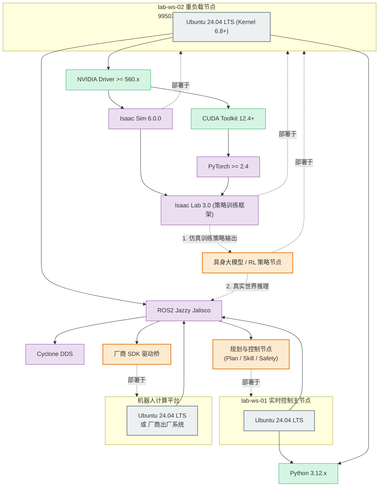

# 软件版本矩阵 v1.3

| 属性 | 内容 |
|------|------|
| **文档编号** | TECH-04 |
| **版本** | v1.3 |
| **维护人** | R2 |
| **依据** | [PLAN-FUSION-01](../plan/platform_wm_fusion_plan_v0.md) · INFRA-02 v1.3 · 世界模型 FR3 §1.0 钉扎（本地挂载） |

---

## 一、核心基线 (Base Environment)

鉴于 `lab-ws-02` 采用了极新的硬件架构（AMD Ryzen 9 9950X3D + RTX 5090D），Ubuntu 22.04 的旧内核无法完美发挥其异构核心调度与最新显卡性能。因此，**全实验室基础环境整体跃迁至 2024+ 世代的 LTS 版本**：

| 组件 | 版本要求 | 备注 |
|------|----------|------|
| **OS** | Ubuntu 24.04 LTS (Noble Numbat) | 原生搭载 6.8+ 内核；全量节点统一。 |
| **ROS 2** | Jazzy Jalisco | 仅 **lab-ws-01 / onboard**；**ws-02 不进 ROS 域**。 |
| **Python** | **3.12.x** | 与 Isaac Sim 6.x / 策略栈对齐。 |
| **C++ Standard**| C++17 / C++20 | 编译 ROS2 Jazzy 节点的标准。 |

---

## 二、GPU 与深度学习基线 (AI Environment)

针对 `lab-ws-02` (5090D) 及其它 GPU 节点：

| 组件 | 版本要求 | 备注 |
|------|----------|------|
| **NVIDIA Driver**| **≥ 560.x**（建议生产分支 **≥580.x** 若 Isaac 兼容检查器要求） | RTX 50 系列；以 Isaac 官方兼容矩阵为准 |
| **CUDA Toolkit** | 随 Isaac Lab / PyTorch 轮子 | **勿**另装冲突的系统 CUDA 强绑 |
| **cuDNN** | 随 PyTorch 轮子 | — |
| **PyTorch** | **2.10.x + cu128**（x86_64）优先；最低 ≥2.4 cu124 | **以 Isaac Lab 发行说明为准**；钉扎后写入 run manifest |

---

## 三、具身智能仿真与策略开发基线 (Embodied AI)

| 组件 | 版本要求 | 备注 |
|------|----------|------|
| **Isaac Sim** | **6.0.x**（如 6.0.0 / 6.0.1） | Phase-1 FR3 主仿真；**禁止**混用 5.1 及更旧 |
| **Isaac Lab** | **release/3.0.0-beta2** 或其后同线稳定标签 | 与 Sim 6.0 配对；首次跑通后 **commit/tag 写入 run manifest** |
| **DDS 实现** | Cyclone DDS | 仅 Real 域（ws-01/onboard） |
| **主任务 / 场景** | `tabletop_pickplace_v0` · device `franka-01` | 取代 Go2 `velocity_rough` 作为 Phase-1 主路径 |
| **LeRobot** | Dataset **v3.0** 兼容发布版 | 采数主路径；精确 pip 版本写入 manifest |
| **回归任务** | Go2 locomotion（既有） | 不计入 Phase-1 融合 Go |

**纪律**：未完成环境钉扎与 INFRA-02 **M2（FR3 Hello）** 前，不并行维护第二套仿真（MuJoCo 等）。版本变更须改本表并升 TECH-04 小版本。

---

## 四、软件部署拓扑与依赖关系图 (Mermaid)

> 本图展示了上述锁定的软件版本是如何部署在不同硬件节点上的，以及它们在具身智能策略开发 (Sim2Real) 闭环中的上下游依赖关系。

---

## 五、Phase-1 节点角色与版本落点

| 节点 | 必装 | 模式 / 域 |
|------|------|-----------|
| **lab-ws-02** | Ubuntu 24.04 · Driver · Isaac Sim 6 · Isaac Lab 3 线 · PyTorch · lab_platform · **ROS2 Jazzy（已装可用）** | **CTRL-SIM**：`ROS_DOMAIN_ID=43` + Cyclone；**BATCH**：可不启 ROS |
| **lab-ws-01** | Ubuntu 24.04 · ROS2 Jazzy · Cyclone · lab_platform · ros2 工作区 | **真机域 `ROS_DOMAIN_ID=42`** |
| **FR3 真机工控** | Phase-2：`libfranka` / `franka_ros2` · Jazzy | DOMAIN 42 |
| **Go2 onboard** | 回归用 | DOMAIN 42；动态真机受安全门禁 |

### 5.1 ROS Domain 钉扎（强制）

| 域 ID | 用途 | 成员 |
|------|------|------|
| **42** | 真机 Real 栈 | ws-01 ↔ 机器人 onboard |
| **43** | CTRL-SIM 控制仿真 | **仅 lab-ws-02**（Isaac + franka_sim_bridge + Mid 等） |

**禁止**：在 ws-02 CTRL-SIM 会话使用 42；禁止两域桥接。  
Isaac↔ROS2 桥组件版本（官方或自研）须记入 run manifest / `m2_env_pin.md`。

---

## 六、版本变更控制 (CR)

- **Minor 升级** (如 Python 3.12.2 -> 3.12.4)：R2 自行决定，无需审批；仍建议记入 manifest。
- **Major 升级** (如 ROS2 Jazzy -> Kilted，或 Isaac Sim 大版本更新)：**必须走 CR**，由 R1 审批，并需提供回归（至少 INFRA-02 M2 + R-Go2 E3）。
- **Isaac Lab tag 变更**：升 TECH-04 小版本，并更新 INFRA-02 进度备注。

---

## 七、变更记录

| 版本 | 日期 | 说明 |
|------|------|------|
| v1.0-draft | 2026-06 | 首版；24.04/Jazzy 基线 |
| v1.1 | 2026-07-09 | 维护人/审批人 R1/R2 |
| v1.2 | 2026-08-03 | 对齐 PLAN-FUSION / FR3；Isaac 钉扎；主任务桌面抓放 |
| **v1.3** | 2026-08-03 | **双模式**；DOMAIN **42/43**；ws-02 CTRL-SIM 允许 ROS2 |
