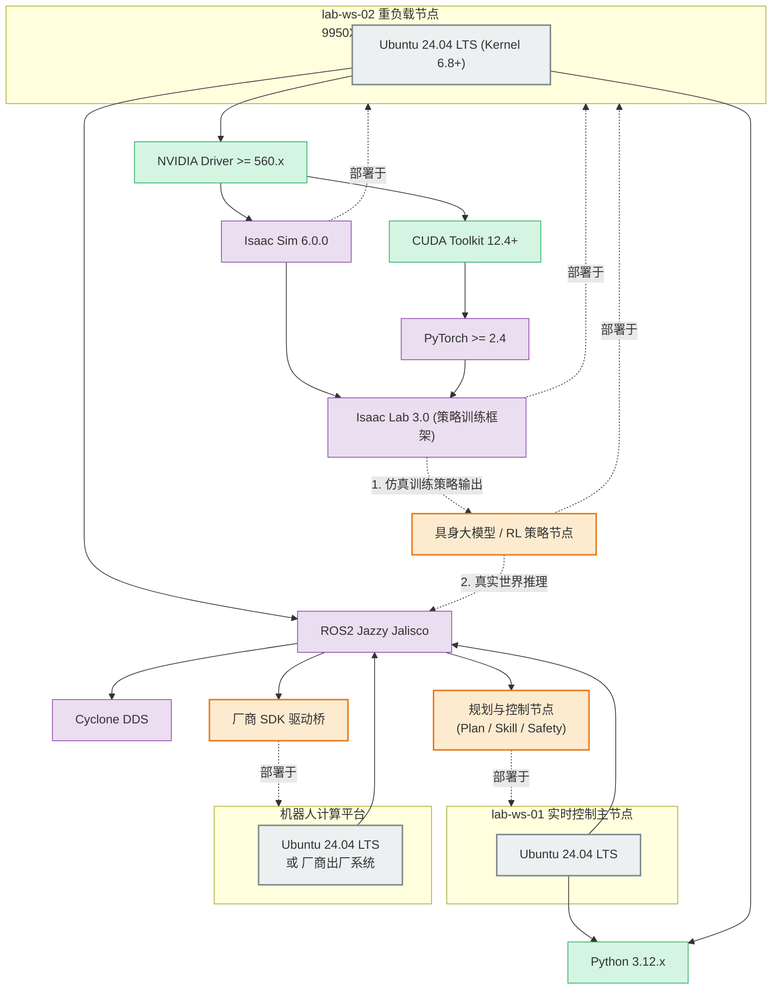

# 软件版本矩阵 v1.0-draft

| 属性 | 内容 |
|------|------|
| **文档编号** | TECH-04 |
| **版本** | v1.0-draft |
| **维护人** | P2 |

---

## 一、核心基线 (Base Environment)

鉴于 `lab-ws-02` 采用了极新的硬件架构（AMD Ryzen 9 9950X3D + RTX 5090D），Ubuntu 22.04 的旧内核无法完美发挥其异构核心调度与最新显卡性能。因此，**全实验室基础环境整体跃迁至 2024+ 世代的 LTS 版本**：

| 组件 | 版本要求 | 备注 |
|------|----------|------|
| **OS** | Ubuntu 24.04 LTS (Noble Numbat) | 原生搭载 6.8+ 内核，完美支持 9950X3D 调度与 5090D 驱动。全量节点统一升级。 |
| **ROS 2** | Jazzy Jalisco | Ubuntu 24.04 对应的长期支持版 (LTS，支持至 2029 年)。 |
| **Python** | 3.12.x | Ubuntu 24.04 默认版本。具身智能策略框架强依赖。 |
| **C++ Standard**| C++17 / C++20 | 编译 ROS2 Jazzy 节点的标准。 |

---

## 二、GPU 与深度学习基线 (AI Environment)

针对 `lab-ws-02` (5090D) 及其它 GPU 节点：

| 组件 | 版本要求 | 备注 |
|------|----------|------|
| **NVIDIA Driver**| >= 560.x | 必须使用 560 或更新分支以支持 RTX 50 系列架构。 |
| **CUDA Toolkit** | 12.4.x (或更高) | 匹配新版驱动与 PyTorch。 |
| **cuDNN** | 9.x | 匹配 CUDA 12.4+。 |
| **PyTorch** | >= 2.4.x (cu124) | 兼容 Python 3.12 与最新 CUDA。 |

---

## 三、具身智能仿真与策略开发基线 (Embodied AI)

补齐具身智能从仿真到现实 (Sim2Real) 策略落地的全链路工具栈：

| 组件 | 版本要求 | 备注 |
|------|----------|------|
| **Isaac Sim** | 6.0.0 | NVIDIA 2026 年最新版，支持多物理引擎后端与异步渲染。 |
| **Isaac Lab** | 3.0.0-beta | (原 Orbit) 基于 Isaac Sim 6.0 的统一机器人学习框架，支持强化学习与模仿学习。 |
| **DDS 实现** | Cyclone DDS | 替换默认的 FastDDS，解决多机大流量丢包问题。 |

---

## 四、软件部署拓扑与依赖关系图 (Mermaid)

> 本图展示了上述锁定的软件版本是如何部署在不同硬件节点上的，以及它们在具身智能策略开发 (Sim2Real) 闭环中的上下游依赖关系。

---

## 五、版本变更控制 (CR)

- **Minor 升级** (如 Python 3.12.2 -> 3.12.4)：P2 自行决定，无需审批。
- **Major 升级** (如 ROS2 Jazzy -> Kilted，或 Isaac Sim 大版本更新)：**必须走 CR 流程**，由 P1 审批，并需提供所有设备的回归测试报告。
